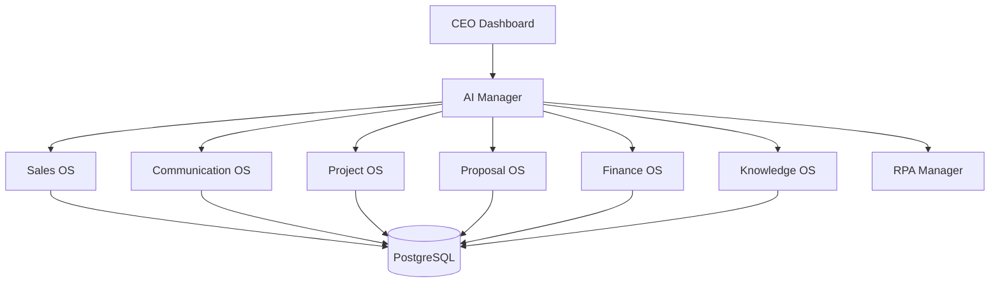
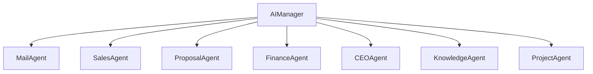
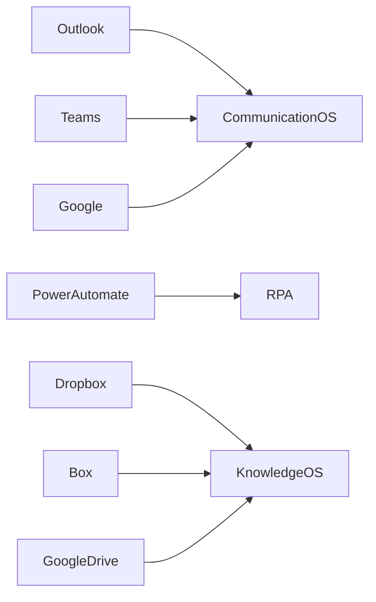
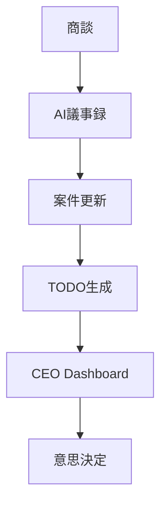

# 01 System Architecture

Version: 1.0

Status: Draft

---

# 1. システム全体構成

VTaBridge OS は、複数の業務システムを AI Manager が統括する構成とする。

---

# 2. モジュール構成

## CEO Dashboard

責務

- KPI表示
- 今日のタスク
- 売上
- 利益
- AI提案
- アラート表示

---

## AI Manager

責務

- AI Agent管理
- イベント管理
- タスク生成
- ワークフロー制御
- 優先順位決定

---

## Sales OS

責務

- 商談管理
- CRM
- 営業活動
- 商談履歴
- AI議事録

---

## Communication OS

責務

- Outlook連携
- Gmail連携
- Teams
- Slack
- AIメール返信
- 未返信検知

---

## Proposal OS

責務

- 見積書
- 契約書
- 請求書
- PDF生成

---

## Project OS

責務

- 案件管理
- エンジニア管理
- 進捗管理
- 納品管理

---

## Finance OS

責務

- 入金確認
- 売上
- 利益
- キャッシュフロー

---

## Knowledge OS

責務

- ドキュメント検索
- AI検索
- FAQ
- ナレッジ蓄積

---

## RPA Manager

責務

- GUI操作
- Legacyシステム入力
- Power Automate連携
- 実行ログ

---

# 3. AI構成

AI Agent同士は直接通信しない。

すべて AI Manager を経由する。

---

# 4. 外部サービス

将来的に Microsoft 365、Google Workspace、電子契約サービスとの連携を追加する。

---

# 5. データフロー

---

# 6. イベントフロー

商談完了

↓

AI議事録

↓

案件更新

↓

TODO生成

↓

メール下書き作成

↓

見積作成

↓

CEO通知

---

# 7. システム境界

AIが行う処理

- 分析
- 要約
- 提案
- 文章生成

人が行う処理

- 商談
- 契約承認
- 見積承認
- 請求承認
- 送信
- 支払

---

# 8. 非機能要件

システム停止時でも案件情報を保持する。

すべての重要操作は監査ログへ記録する。

AIの回答は必ず人が確認できる設計とする。

---

# 9. 今後の詳細設計

次章では以下を定義する。

- データベース設計
- テーブル設計
- Prisma Schema
- ER図
- JSON Schema
