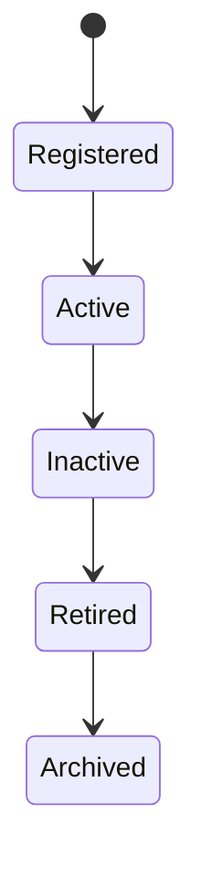
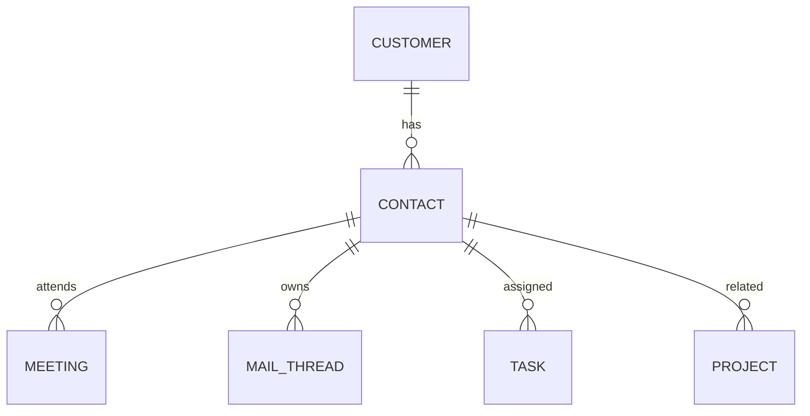

# Contact

Version: 1.0

Status: Draft

Priority: ★★★★★ (Core Domain)

---

# 1. 概要

Contact（担当者）は、顧客企業に所属する人物を管理するエンティティである。

VTaBridge OSでは、営業活動・メール・商談・議事録・契約・AI分析など、すべてのコミュニケーションは Contact を中心に管理する。

Customer（会社）と Contact（担当者）は 1:N の関係となる。

---

# 2. 責務

Contactは以下の責務を持つ。

- 顧客担当者情報の管理
- 営業窓口管理
- メール送受信履歴管理
- 商談履歴管理
- 名刺情報管理
- AIによる担当者分析
- 関係性（リレーション）管理

---

# 3. ライフサイクル

---

# 4. テーブル定義

| Column | Type | Required | Description |
|---------|------|----------|-------------|
| id | UUID | ○ | 主キー |
| customer_id | UUID | ○ | Customer ID |
| first_name | VARCHAR(100) | ○ | 名 |
| last_name | VARCHAR(100) | ○ | 姓 |
| full_name | VARCHAR(200) | ○ | 氏名 |
| department | VARCHAR(200) | × | 部署 |
| position | VARCHAR(200) | × | 役職 |
| email | VARCHAR(255) | ○ | メールアドレス |
| mobile | VARCHAR(50) | × | 携帯番号 |
| phone | VARCHAR(50) | × | 固定電話 |
| preferred_language | VARCHAR(50) | × | 使用言語 |
| timezone | VARCHAR(100) | × | タイムゾーン |
| notes | TEXT | × | メモ |
| relationship_score | INT | ○ | AI評価(0～100) |
| last_contact_at | TIMESTAMP | × | 最終接触日時 |
| status | ContactStatus | ○ | 状態 |
| created_at | TIMESTAMP | ○ | 作成日時 |
| updated_at | TIMESTAMP | ○ | 更新日時 |
| deleted_at | TIMESTAMP | × | 論理削除 |

---

# 5. リレーション

---

# 6. Enum

## ContactStatus

- Active
- Inactive
- Retired
- Archived

---

# 7. 業務ルール

- Contactは必ずCustomerに所属する
- 同一Customer内でメールアドレスは重複不可
- メールアドレス変更時は履歴を保持する
- 削除は論理削除のみ
- AI評価は自動更新する

---

# 8. AI機能

AIは以下を支援する。

- 担当者との関係性スコア算出
- メール返信案作成
- 商談要約
- 次回アクション提案
- 返信漏れ検知
- 優先顧客判定
- 温度感分析（興味度・商談化可能性）

---

# 9. API

| Method | Endpoint |
|---------|----------|
| GET | /contacts |
| GET | /contacts/{id} |
| POST | /contacts |
| PUT | /contacts/{id} |
| DELETE | /contacts/{id} |

---

# 10. Index

- customer_id
- email
- last_contact_at
- relationship_score
- status

---

# 11. KPI

Contactから以下を集計する。

- アクティブ担当者数
- 月間接触回数
- 平均返信速度
- 商談化率
- AI関係性スコア平均

---

# 12. Prisma実装方針

Model名

Contact

Table名

contacts

UUIDを採用する。

メールアドレスはCustomer単位でUnique制約を設定する。

---

# 13. 将来拡張

将来的に以下を追加する。

- LinkedIn連携
- 名刺OCR
- Teams連携
- Outlook同期
- Google Contacts同期
- AI人格分析
- AI最適連絡時間分析
