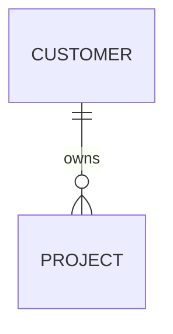

# Customer

Version: 1.0

Status: Draft

---

# 1. 概要

Customer は VTaBridge と取引する企業情報を管理する。

Customer は Project を所有する。

Customer 自体は営業活動を持たず、Project を通して管理される。

---

# 2. 責務

Customer の責務は以下とする。

- 企業情報管理
- 担当者情報管理
- 契約先管理
- Projectとの関連付け

---

# 3. 保持データ

| 項目 | 内容 |
|------|------|
| 会社名 | 法人格を含む正式名称 |
| 会社名（略称） | 一覧表示用 |
| 法人番号 | 任意 |
| Webサイト | URL |
| 郵便番号 | |
| 住所 | |
| 代表電話 | |
| 業種 | |
| 従業員数 | 任意 |
| メモ | AI要約対象外 |

---

# 4. テーブル定義

| Column | Type | Required | Description |
|---------|------|----------|-------------|
| id | UUID | ○ | 主キー |
| company_name | VARCHAR(255) | ○ | 正式名称 |
| short_name | VARCHAR(100) | × | 略称 |
| corporate_number | VARCHAR(20) | × | 法人番号 |
| website | VARCHAR(2048) | × | Webサイト |
| postal_code | VARCHAR(20) | × | 郵便番号 |
| prefecture | VARCHAR(50) | × | 都道府県 |
| city | VARCHAR(100) | × | 市区町村 |
| address1 | VARCHAR(255) | × | 住所 |
| address2 | VARCHAR(255) | × | 建物名 |
| phone | VARCHAR(50) | × | 代表電話 |
| industry | VARCHAR(100) | × | 業種 |
| employee_count | INTEGER | × | 従業員数 |
| notes | TEXT | × | 備考 |
| created_at | TIMESTAMP | ○ | 作成日時 |
| updated_at | TIMESTAMP | ○ | 更新日時 |
| deleted_at | TIMESTAMP | × | 論理削除 |

---

# 5. リレーション

Customer は複数の Project を持つ。

Project は必ず 1 Customer に所属する。

---

# 6. Enum

現時点では使用しない。

---

# 7. 業務ルール

- 同一法人を重複登録しない
- 法人格を含めた正式名称を保持する
- 顧客削除時もProjectは削除しない
- deleted_at により論理削除する

---

# 8. AI利用

AI は Customer 情報を利用して

- メール生成
- 提案書作成
- 商談要約

を行う。

AI が Customer 情報を書き換えることは禁止する。

---

# 9. API予定

| Method | Endpoint |
|---------|----------|
| GET | /customers |
| GET | /customers/{id} |
| POST | /customers |
| PUT | /customers/{id} |
| DELETE | /customers/{id} |

---

# 10. Index

以下をIndex対象とする。

- company_name
- corporate_number
- created_at

---

# 11. Prisma実装方針

Model名

Customer

テーブル名

customers

Primary Key

UUID

---

# 12. 将来拡張

追加予定

- 担当者一覧
- 契約履歴
- 与信情報
- AI企業分析
- 名刺OCR連携
