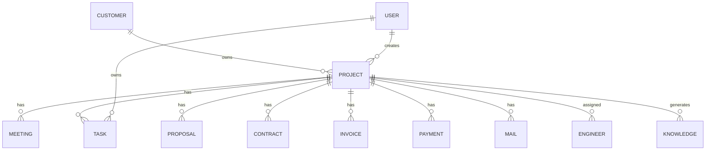

# 02 Database Design

Version: 1.0

Status: Draft

---

# 1. データベース概要

VTaBridge OS は PostgreSQL を採用する。

ORM は Prisma を利用する。

すべての業務データは Project（案件）を中心に管理する。

---

# 2. 基本方針

- UUIDを主キーとする
- 外部キーを必ず利用する
- 論理削除を採用する
- 作成日時・更新日時を保持する
- 監査ログを残す

---

# 3. コアエンティティ

システムの中心となるエンティティは以下である。

Customer

Project

Meeting

Task

Engineer

Proposal

Contract

Invoice

Payment

Mail

Attachment

User

AI Log

Audit Log

Knowledge

---

# 4. ER図

---

# 5. Customer

保持する情報

- 会社名
- 部署
- 担当者
- メール
- 電話番号
- 郵便番号
- 住所
- 業種
- Webサイト

---

# 6. Project

保持する情報

- 案件名
- 顧客
- 営業担当
- ステータス
- 開始日
- 終了予定日
- 契約金額
- 利益率
- 案件概要
- AI要約

Project がシステムの中心となる。

---

# 7. Meeting

保持する情報

- 日時
- 参加者
- 議事録
- AI要約
- 音声ファイル
- TODO

---

# 8. Task

保持する情報

- タイトル
- 担当者
- 優先度
- 状態
- 期限
- AI作成フラグ

---

# 9. Mail

保持する情報

- 件名
- 差出人
- 宛先
- 本文
- AI返信案
- ステータス
- 添付ファイル

---

# 10. Proposal

保持する情報

- 見積番号
- PDF
- 金額
- 作成日
- AI生成内容

---

# 11. Contract

保持する情報

- 契約番号
- 契約金額
- 開始日
- 終了日
- 契約ファイル

---

# 12. Invoice

保持する情報

- 請求番号
- 金額
- 発行日
- 支払期限
- PDF

---

# 13. Payment

保持する情報

- 入金日
- 金額
- ステータス
- 銀行情報

---

# 14. AI Log

AIの実行履歴を保存する。

保持する情報

- Agent
- Prompt
- Response
- Cost
- Token
- Duration

---

# 15. Audit Log

すべての更新履歴を保存する。

保持する情報

- User
- Action
- Target
- Before
- After
- Timestamp

---

# 16. 命名規則

テーブル名

複数形を採用する。

例

customers

projects

tasks

---

カラム名

snake_case

---

主キー

id

UUID

---

日時

created_at

updated_at

deleted_at

---

# 17. インデックス

インデックスを付与する項目

- project_id
- customer_id
- user_id
- status
- created_at
- updated_at

---

# 18. 今後の詳細設計

次章ではPrisma Schemaを定義する。

Prisma Schemaを唯一のデータベース定義とし、

Migrationを管理する。
