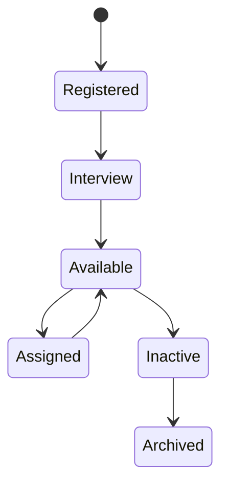
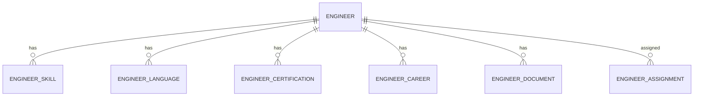

# Engineer

Version: 1.0

Status: Draft

Priority: ★★★★★ (Core Domain)

---

# 1. 概要

Engineer（エンジニア）は、VTaBridgeが管理する国内・海外エンジニアの基本情報を管理するエンティティである。

本エンティティは案件管理ではなく「人材管理」を目的とする。

スキル・資格・言語・経歴・案件参画履歴などは別エンティティで管理し、本エンティティは人材マスタとして利用する。

---

# 2. 責務

Engineerは以下の責務を持つ。

- エンジニア基本情報管理
- 在籍状況管理
- 国籍・居住国管理
- 稼働状況管理
- 単価管理
- AIによる人材評価
- プロフィール管理

---

# 3. ライフサイクル

---

# 4. テーブル定義

| Column | Type | Required | Description |
|---------|------|----------|-------------|
| id | UUID | ○ | 主キー |
| engineer_code | VARCHAR(30) | ○ | エンジニアコード |
| first_name | VARCHAR(100) | ○ | 名 |
| last_name | VARCHAR(100) | ○ | 姓 |
| full_name | VARCHAR(200) | ○ | 氏名 |
| email | VARCHAR(255) | ○ | メールアドレス |
| phone | VARCHAR(50) | × | 電話番号 |
| nationality | VARCHAR(100) | ○ | 国籍 |
| residence_country | VARCHAR(100) | ○ | 居住国 |
| timezone | VARCHAR(100) | ○ | タイムゾーン |
| years_of_experience | DECIMAL(4,1) | ○ | 実務経験年数 |
| expected_monthly_rate | DECIMAL(12,2) | × | 希望月額単価 |
| current_monthly_rate | DECIMAL(12,2) | × | 現在単価 |
| availability | AvailabilityStatus | ○ | 稼働状況 |
| engineer_rank | EngineerRank | ○ | 社内ランク |
| ai_score | INT | ○ | AI評価 |
| profile_summary | TEXT | × | AIプロフィール |
| created_at | TIMESTAMP | ○ | 作成日時 |
| updated_at | TIMESTAMP | ○ | 更新日時 |
| deleted_at | TIMESTAMP | × | 論理削除 |

---

# 5. リレーション

---

# 6. Enum

## AvailabilityStatus

- Available
- Assigned
- Vacation
- Inactive

---

## EngineerRank

- Junior
- Middle
- Senior
- Lead
- Principal

---

# 7. 業務ルール

- エンジニアコードは自動採番する
- メールアドレスは一意
- 削除は論理削除のみ
- 稼働状況は案件情報と同期する
- AI評価は定期的に更新する

---

# 8. AI機能

AIは以下を支援する。

- プロフィール要約
- スキル分析
- 案件マッチング
- 単価妥当性分析
- スキル不足分析
- 次に取得すべき資格提案
- 案件推薦順位付け

---

# 9. API

| Method | Endpoint |
|---------|----------|
| GET | /engineers |
| GET | /engineers/{id} |
| POST | /engineers |
| PUT | /engineers/{id} |
| DELETE | /engineers/{id} |

---

# 10. Index

- engineer_code
- email
- nationality
- residence_country
- availability
- ai_score

---

# 11. KPI

Engineerから以下を集計する。

- 稼働率
- 平均単価
- 平均AIスコア
- スキル保有数
- 資格保有数
- 案件アサイン率

---

# 12. Prisma実装方針

Model名

Engineer

Table名

engineers

UUIDを採用する。

EngineerCodeはUnique制約を設定する。

---

# 13. 将来拡張

将来的に以下を追加する。

- GitHub連携
- LinkedIn連携
- Stack Overflow連携
- Kaggle連携
- LeetCode連携
- AIスキル評価
- AIキャリアプランニング
