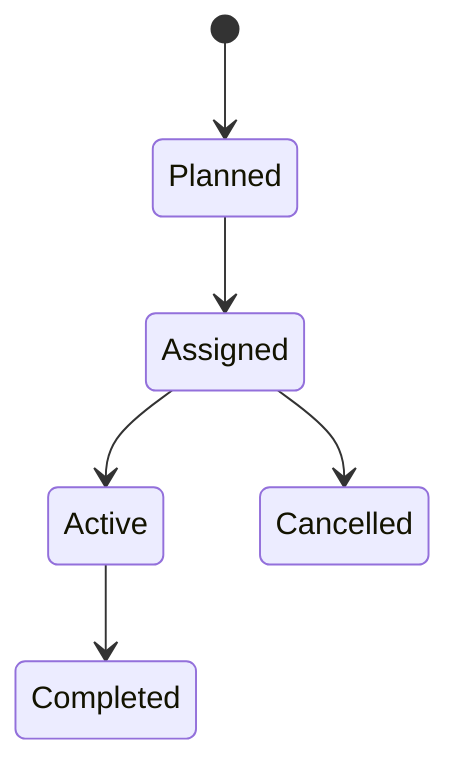
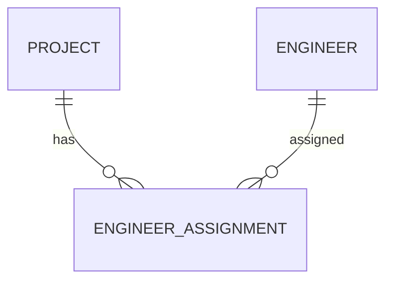

# EngineerAssignment

Version: 1.0

Status: Draft

Priority: ★★★★★ (Core Domain)

---

# 1. 概要

EngineerAssignment（エンジニアアサイン）は、案件（Project）とエンジニア（Engineer）の関連を管理する中間エンティティである。

1案件に複数のエンジニアが参画でき、1人のエンジニアが複数案件へ参画できる多対多（Many-to-Many）の関係を実現する。

---

# 2. 責務

EngineerAssignmentは以下の責務を持つ。

- 案件へのエンジニアアサイン管理
- 参画期間管理
- 契約単価管理
- 稼働率管理
- 役割管理
- 参画履歴管理

---

# 3. ライフサイクル

---

# 4. テーブル定義

| Column | Type | Required | Description |
|---------|------|----------|-------------|
| id | UUID | ○ | 主キー |
| project_id | UUID | ○ | Project ID |
| engineer_id | UUID | ○ | Engineer ID |
| role | VARCHAR(100) | ○ | 担当ロール |
| assignment_status | AssignmentStatus | ○ | アサイン状況 |
| monthly_rate | DECIMAL(12,2) | × | 月額単価 |
| hourly_rate | DECIMAL(12,2) | × | 時間単価 |
| allocation_rate | DECIMAL(5,2) | ○ | 稼働率(%) |
| start_date | DATE | ○ | 参画開始日 |
| end_date | DATE | × | 参画終了日 |
| remarks | TEXT | × | 備考 |
| created_at | TIMESTAMP | ○ | 作成日時 |
| updated_at | TIMESTAMP | ○ | 更新日時 |
| deleted_at | TIMESTAMP | × | 論理削除 |

---

# 5. リレーション

---

# 6. Enum

## AssignmentStatus

- Planned
- Assigned
- Active
- Completed
- Cancelled

---

# 7. 業務ルール

- ProjectとEngineerが存在する場合のみ登録可能
- 同一期間で同一案件・同一エンジニアの重複登録は禁止
- 削除は論理削除のみ
- 稼働率は0〜100%で管理する

---

# 8. AI機能

AIは以下を支援する。

- 最適なエンジニア提案
- 稼働率分析
- アサイン漏れ検知
- リソース不足予測
- 単価分析

---

# 9. API

| Method | Endpoint |
|---------|----------|
| GET | /assignments |
| GET | /assignments/{id} |
| POST | /assignments |
| PUT | /assignments/{id} |
| DELETE | /assignments/{id} |

---

# 10. Index

- project_id
- engineer_id
- assignment_status
- start_date
- end_date

---

# 11. KPI

EngineerAssignmentから以下を集計する。

- 稼働率
- エンジニアアサイン率
- 平均参画期間
- 月間アサイン数

---

# 12. Prisma実装方針

Model名

EngineerAssignment

Table名

engineer_assignments

UUIDを採用する。

Project・Engineerとの外部キー制約を設定する。

---

# 13. 将来拡張

将来的に以下を追加する。

- 工数管理
- 勤怠連携
- Slack通知
- Teams通知
- 契約更新通知
- AI自動アサイン
