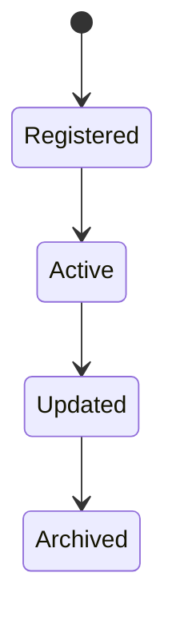
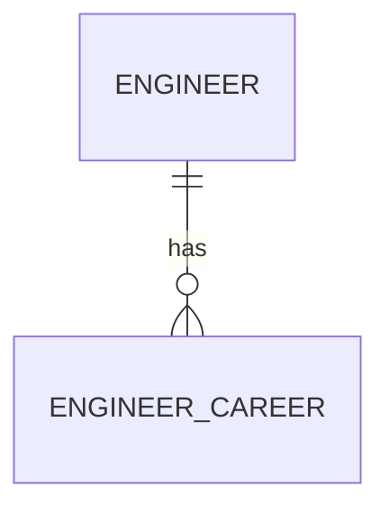

# EngineerCareer

Version: 1.0

Status: Draft

Priority: ★★★★★ (Core Domain)

---

# 1. 概要

EngineerCareerは、エンジニアの職務経歴を管理するエンティティである。

過去の参画案件、担当業務、利用技術、成果などを管理し、営業提案・AIマッチング・プロフィール自動生成に利用する。

---

# 2. 責務

EngineerCareerは以下の責務を持つ。

- 職務経歴管理
- 参画案件管理
- 担当業務管理
- 利用技術管理
- 成果管理
- AIによる経歴分析

---

# 3. ライフサイクル

---

# 4. テーブル定義

| Column | Type | Required | Description |
|---------|------|----------|-------------|
| id | UUID | ○ | 主キー |
| engineer_id | UUID | ○ | Engineer ID |
| company_name | VARCHAR(200) | ○ | 会社名 |
| project_name | VARCHAR(255) | ○ | 案件名 |
| industry | VARCHAR(100) | × | 業界 |
| role | VARCHAR(100) | ○ | 担当ロール |
| employment_type | VARCHAR(100) | × | 契約形態 |
| start_date | DATE | ○ | 開始日 |
| end_date | DATE | × | 終了日 |
| duration_months | INT | × | 参画期間（月） |
| project_summary | TEXT | ○ | 案件概要 |
| responsibilities | TEXT | ○ | 担当業務 |
| technologies | JSON | ○ | 使用技術 |
| team_size | INT | × | チーム人数 |
| achievements | TEXT | × | 実績・成果 |
| reference_available | BOOLEAN | ○ | 実績確認可否 |
| created_at | TIMESTAMP | ○ | 作成日時 |
| updated_at | TIMESTAMP | ○ | 更新日時 |
| deleted_at | TIMESTAMP | × | 論理削除 |

---

# 5. リレーション

---

# 6. Enum

## EmploymentType

- FullTime
- Contract
- Freelance
- Outsourcing
- Internship

---

# 7. 業務ルール

- Engineerが存在する場合のみ登録可能
- 開始日は終了日以前であること
- 削除は論理削除のみ
- technologiesはJSON配列で管理する

---

# 8. AI機能

AIは以下を支援する。

- 職務経歴書自動作成
- 経歴要約
- スキル抽出
- 案件マッチング
- キャリア分析
- 提案資料作成支援

---

# 9. API

| Method | Endpoint |
|---------|----------|
| GET | /engineer-careers |
| GET | /engineer-careers/{id} |
| POST | /engineer-careers |
| PUT | /engineer-careers/{id} |
| DELETE | /engineer-careers/{id} |

---

# 10. Index

- engineer_id
- company_name
- project_name
- role
- start_date
- end_date

---

# 11. KPI

EngineerCareerから以下を集計する。

- 平均経験年数
- 業界別経験人数
- 技術別経験人数
- 平均参画期間
- ロール別経験人数

---

# 12. Prisma実装方針

Model名

EngineerCareer

Table名

engineer_careers

UUIDを採用する。

Engineerとの外部キー制約を設定する。

---

# 13. 将来拡張

将来的に以下を追加する。

- GitHubコミット履歴連携
- Jira連携
- Backlog連携
- 成果物ポートフォリオ管理
- AIによる経歴添削
- AIによる案件適合率算出
