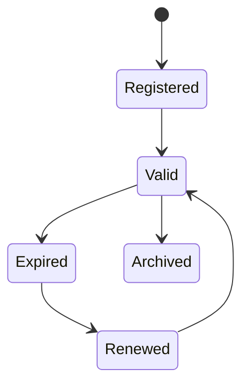
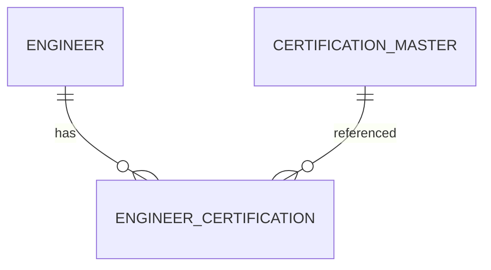

# EngineerCertification

Version: 1.0

Status: Draft

Priority: ★★★★☆ (Core Domain)

---

# 1. 概要

EngineerCertificationは、エンジニアが保有する資格情報を管理するエンティティである。

資格はCertificationMasterを参照し、取得日・有効期限・認定番号などを管理する。

案件提案時のスキル証明およびAIによるマッチングに利用する。

---

# 2. 責務

EngineerCertificationは以下の責務を持つ。

- 保有資格管理
- 資格取得日管理
- 有効期限管理
- 資格証明書管理
- AIによる資格分析

---

# 3. ライフサイクル

---

# 4. テーブル定義

| Column | Type | Required | Description |
|---------|------|----------|-------------|
| id | UUID | ○ | 主キー |
| engineer_id | UUID | ○ | Engineer ID |
| certification_id | UUID | ○ | CertificationMaster ID |
| certification_number | VARCHAR(100) | × | 認定番号 |
| issued_date | DATE | ○ | 取得日 |
| expiration_date | DATE | × | 有効期限 |
| issuing_organization | VARCHAR(200) | × | 認定機関 |
| verification_url | VARCHAR(500) | × | 資格確認URL |
| certificate_file | VARCHAR(500) | × | 証明書ファイル |
| status | CertificationStatus | ○ | 資格状態 |
| notes | TEXT | × | 備考 |
| created_at | TIMESTAMP | ○ | 作成日時 |
| updated_at | TIMESTAMP | ○ | 更新日時 |
| deleted_at | TIMESTAMP | × | 論理削除 |

---

# 5. リレーション

---

# 6. Enum

## CertificationStatus

- Valid
- Expired
- Suspended
- Archived

---

# 7. 業務ルール

- EngineerとCertificationMasterが存在する場合のみ登録可能
- 同一資格は重複登録不可
- 有効期限切れはExpiredへ変更する
- 削除は論理削除のみ

---

# 8. AI機能

AIは以下を支援する。

- 必須資格不足分析
- 取得推奨資格提案
- 更新期限通知
- 案件との資格マッチング
- 資格ランキング分析
---

# 9. API

| Method | Endpoint |
|---------|----------|
| GET | /engineer-certifications |
| GET | /engineer-certifications/{id} |
| POST | /engineer-certifications |
| PUT | /engineer-certifications/{id} |
| DELETE | /engineer-certifications/{id} |

---

# 10. Index

- engineer_id
- certification_id
- status
- expiration_date
- issued_date

---

# 11. KPI

EngineerCertificationから以下を集計する。

- 資格保有数
- 有効資格数
- 期限切れ資格数
- エンジニア1人あたりの平均資格数
- 人気資格ランキング

---

# 12. Prisma実装方針

Model名

EngineerCertification

Table名

engineer_certifications

UUIDを採用する。

Engineer・CertificationMasterとの外部キー制約を設定する。

同一Engineerに対して、同一Certificationは一意制約を設定する。

---

# 13. 将来拡張

将来的に以下を追加する。

- Credly連携
- AWS Certification API連携
- Microsoft Learn連携
- Google Cloud Certification連携
- 資格更新リマインダー
- AIによる資格取得ロードマップ作成
- 電子証明書の自動検証
