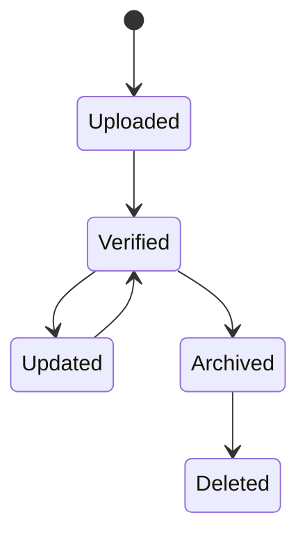
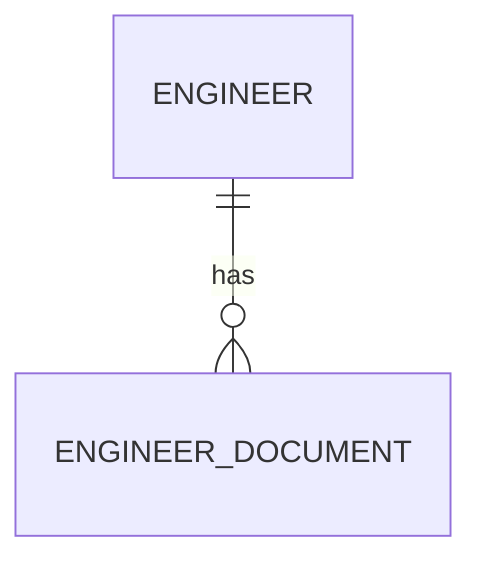

# EngineerDocument

Version: 1.0

Status: Draft

Priority: ★★★★☆ (Core Domain)

---

# 1. 概要

EngineerDocumentは、エンジニアに関連する各種ドキュメントを管理するエンティティである。

履歴書、職務経歴書、資格証明書、契約書、パスポート、在留カードなどのファイル情報を一元管理する。

ファイル本体はクラウドストレージに保存し、本テーブルではメタデータのみ管理する。

---

# 2. 責務

EngineerDocumentは以下の責務を持つ。

- ドキュメント管理
- バージョン管理
- 有効期限管理
- AIによるOCR解析
- ファイルアクセス管理

---

# 3. ライフサイクル

---

# 4. テーブル定義

| Column | Type | Required | Description |
|---------|------|----------|-------------|
| id | UUID | ○ | 主キー |
| engineer_id | UUID | ○ | Engineer ID |
| document_type | DocumentType | ○ | ドキュメント種別 |
| file_name | VARCHAR(255) | ○ | ファイル名 |
| original_file_name | VARCHAR(255) | ○ | 元ファイル名 |
| storage_path | VARCHAR(500) | ○ | 保存先 |
| mime_type | VARCHAR(100) | ○ | MIME Type |
| file_size | BIGINT | ○ | ファイルサイズ(Byte) |
| file_hash | VARCHAR(255) | ○ | SHA-256ハッシュ |
| version | INT | ○ | バージョン |
| issue_date | DATE | × | 発行日 |
| expiration_date | DATE | × | 有効期限 |
| uploaded_by | UUID | ○ | 登録ユーザー |
| verified | BOOLEAN | ○ | 確認済み |
| notes | TEXT | × | 備考 |
| created_at | TIMESTAMP | ○ | 作成日時 |
| updated_at | TIMESTAMP | ○ | 更新日時 |
| deleted_at | TIMESTAMP | × | 論理削除 |

---

# 5. リレーション

---

# 6. Enum

## DocumentType

- Resume
- CV
- Passport
- ResidenceCard
- Certification
- Contract
- NDA
- Portfolio
- Other

---

# 7. 業務ルール

- Engineerが存在する場合のみ登録可能
- ファイル本体はストレージへ保存する
- DBにはメタデータのみ保存する
- 削除は論理削除のみ
- バージョン管理を行う

---

# 8. AI機能

AIは以下を支援する。

- OCR解析
- 履歴書要約
- 職務経歴抽出
- 資格抽出
- 有効期限検出
- ドキュメント分類

---

# 9. API

| Method | Endpoint |
|---------|----------|
| GET | /engineer-documents |
| GET | /engineer-documents/{id} |
| POST | /engineer-documents |
| PUT | /engineer-documents/{id} |
| DELETE | /engineer-documents/{id} |

---

# 10. Index

- engineer_id
- document_type
- expiration_date
- uploaded_by
- verified

---

# 11. KPI

EngineerDocumentから以下を集計する。

- 登録ドキュメント数
- ドキュメント種別別件数
- 有効期限切れ件数
- OCR処理件数
- 未確認ドキュメント数

---

# 12. Prisma実装方針

Model名

EngineerDocument

Table名

engineer_documents

UUIDを採用する。

Engineerとの外部キー制約を設定する。

ファイル本体はオブジェクトストレージ（S3、Azure Blob Storage等）へ保存する。

---

# 13. 将来拡張

将来的に以下を追加する。

- AIによる本人確認
- 電子署名対応
- DocuSign連携
- Adobe Sign連携
- 自動翻訳
- PDF全文検索
- 顔写真照合
