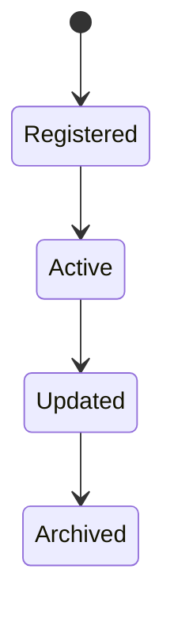
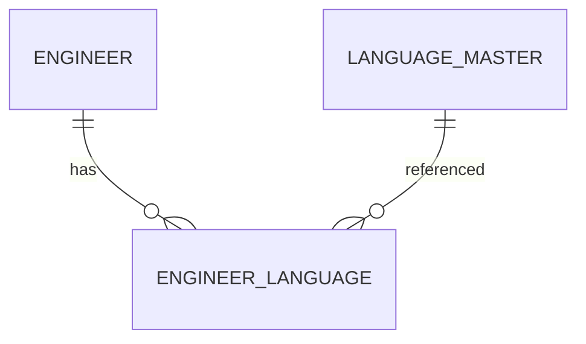

# EngineerLanguage

Version: 1.0

Status: Draft

Priority: ★★★★☆ (Core Domain)

---

# 1. 概要

EngineerLanguageは、エンジニアが利用可能な言語能力を管理するエンティティである。

日本語・英語・その他の言語について、会話・読み書き・ビジネス利用可否などを管理し、案件マッチングや顧客提案時の判断材料として利用する。

LanguageMasterを参照する。

---

# 2. 責務

EngineerLanguageは以下の責務を持つ。

- 使用可能言語管理
- 会話レベル管理
- 読み書きレベル管理
- ビジネス利用可否管理
- AIによる案件マッチング支援

---

# 3. ライフサイクル

---

# 4. テーブル定義

| Column | Type | Required | Description |
|---------|------|----------|-------------|
| id | UUID | ○ | 主キー |
| engineer_id | UUID | ○ | Engineer ID |
| language_id | UUID | ○ | LanguageMaster ID |
| speaking_level | LanguageLevel | ○ | 会話レベル |
| writing_level | LanguageLevel | ○ | 読み書きレベル |
| business_available | BOOLEAN | ○ | ビジネス利用可否 |
| certification | VARCHAR(100) | × | 語学資格 |
| score | VARCHAR(50) | × | 試験スコア |
| notes | TEXT | × | 備考 |
| created_at | TIMESTAMP | ○ | 作成日時 |
| updated_at | TIMESTAMP | ○ | 更新日時 |
| deleted_at | TIMESTAMP | × | 論理削除 |

---

# 5. リレーション

---

# 6. Enum

## LanguageLevel

- None
- Basic
- Conversational
- Business
- Fluent
- Native

---

# 7. 業務ルール

- EngineerとLanguageMasterが存在する場合のみ登録可能
- 同一言語の重複登録は禁止
- 削除は論理削除のみ

---

# 8. AI機能

AIは以下を支援する。

- 案件に必要な言語とのマッチング
- 多言語対応可否判定
- 語学力分析
- 語学学習提案

---

# 9. API

| Method | Endpoint |
|---------|----------|
| GET | /engineer-languages |
| GET | /engineer-languages/{id} |
| POST | /engineer-languages |
| PUT | /engineer-languages/{id} |
| DELETE | /engineer-languages/{id} |

---

# 10. Index

- engineer_id
- language_id
- speaking_level
- business_available

---

# 11. KPI

EngineerLanguageから以下を集計する。

- 多言語対応エンジニア数
- ビジネスレベル以上の保有率
- 言語別保有人数
- 語学資格保有率

---

# 12. Prisma実装方針

Model名

EngineerLanguage

Table名

engineer_languages

UUIDを採用する。

Engineer・LanguageMasterとの外部キー制約を設定する。

---

# 13. 将来拡張

将来的に以下を追加する。

- CEFRとの自動変換
- JLPT連携
- TOEIC・IELTS・TOEFL連携
- AIによる語学力推定
- 面接評価連携
---

# 9. API

| Method | Endpoint |
|---------|----------|
| GET | /engineer-languages |
| GET | /engineer-languages/{id} |
| POST | /engineer-languages |
| PUT | /engineer-languages/{id} |
| DELETE | /engineer-languages/{id} |

---

# 10. Index

- engineer_id
- language_id
- speaking_level
- writing_level
- business_available

---

# 11. KPI

EngineerLanguageから以下を集計する。

- 多言語対応エンジニア数
- ビジネスレベル以上の保有人数
- 言語別エンジニア数
- 語学資格保有率
- 平均語学レベル

---

# 12. Prisma実装方針

Model名

EngineerLanguage

Table名

engineer_languages

UUIDを採用する。

Engineer・LanguageMasterとの外部キー制約を設定する。

同一Engineerに対して、同一Languageは一意制約を設定する。

---

# 13. 将来拡張

将来的に以下を追加する。

- CEFRとの自動変換
- JLPT連携
- TOEIC・IELTS・TOEFL連携
- AIによる語学力推定
- 面接評価連携
- 音声会話テスト連携
- AIによる発音評価
