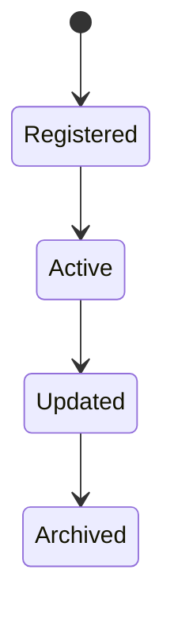
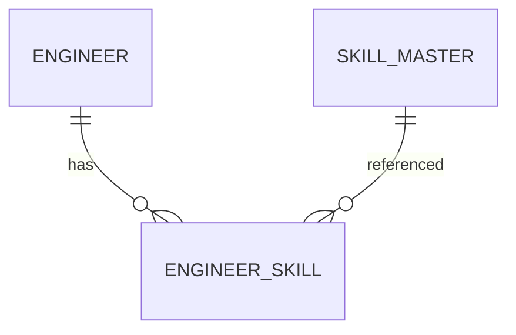

# EngineerSkill

Version: 1.0

Status: Draft

Priority: ★★★★★ (Core Domain)

---

# 1. 概要

EngineerSkillは、エンジニアが保有するスキルを管理するエンティティである。

スキルはマスタ（SkillMaster）と紐付け、スキルレベル・実務経験年数・最終利用日などを管理する。

---

# 2. 責務

EngineerSkillは以下の責務を持つ。

- 保有スキル管理
- スキルレベル管理
- 実務経験年数管理
- 最終利用日管理
- AIスキル分析

---

# 3. ライフサイクル

---

# 4. テーブル定義

| Column | Type | Required | Description |
|---------|------|----------|-------------|
| id | UUID | ○ | 主キー |
| engineer_id | UUID | ○ | Engineer ID |
| skill_id | UUID | ○ | SkillMaster ID |
| skill_level | SkillLevel | ○ | スキルレベル |
| years_of_experience | DECIMAL(4,1) | ○ | 実務経験年数 |
| last_used_at | DATE | × | 最終利用日 |
| self_rating | INT | × | 自己評価(1〜5) |
| ai_rating | INT | × | AI評価(1〜5) |
| notes | TEXT | × | 備考 |
| created_at | TIMESTAMP | ○ | 作成日時 |
| updated_at | TIMESTAMP | ○ | 更新日時 |
| deleted_at | TIMESTAMP | × | 論理削除 |

---

# 5. リレーション

---

# 6. Enum

## SkillLevel

- Beginner
- Junior
- Intermediate
- Advanced
- Expert

---

# 7. 業務ルール

- EngineerとSkillMasterが存在する場合のみ登録可能
- 同一スキルの重複登録は禁止
- スキルレベルはEnumで管理する
- 削除は論理削除のみ

---

# 8. AI機能

AIは以下を支援する。

- スキルギャップ分析
- 最適案件推薦
- スキルレベル推定
- 学習推奨
- スキルランキング生成

---

# 9. API

| Method | Endpoint |
|---------|----------|
| GET | /engineer-skills |
| GET | /engineer-skills/{id} |
| POST | /engineer-skills |
| PUT | /engineer-skills/{id} |
| DELETE | /engineer-skills/{id} |

---

# 10. Index

- engineer_id
- skill_id
- skill_level
- years_of_experience

---

# 11. KPI

EngineerSkillから以下を集計する。

- 保有スキル数
- 平均経験年数
- スキルレベル分布
- AI評価平均

---

# 12. Prisma実装方針

Model名

EngineerSkill

Table名

engineer_skills

UUIDを採用する。

Engineer・SkillMasterとの外部キー制約を設定する。

---

# 13. 将来拡張

将来的に以下を追加する。

- GitHub解析
- コード品質分析
- OSS活動分析
- 資格との相関分析
- AIスキル成長予測
