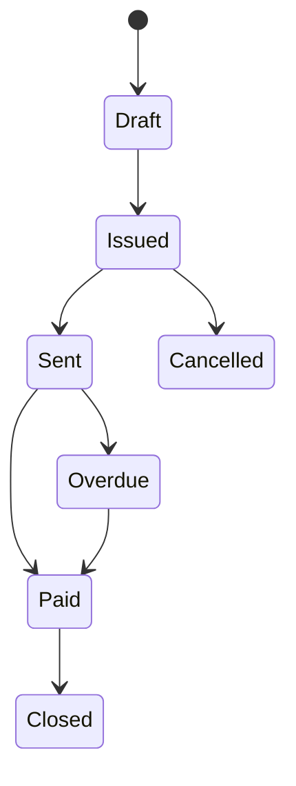
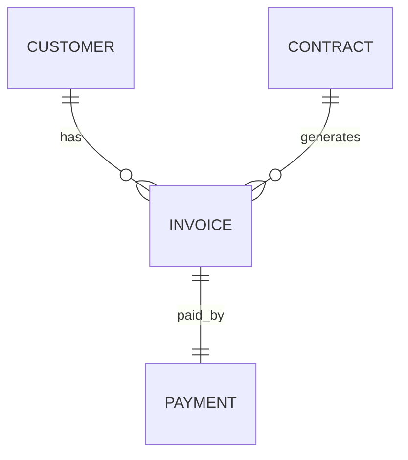

# Invoice

Version: 1.0

Status: Draft

Priority: ★★★★★ (Core Domain)

---

# 1. 概要

Invoiceは、顧客へ発行する請求書を管理するエンティティである。

契約（Contract）に基づき請求書を作成し、請求金額・支払期限・入金状況を管理する。

売上管理・入金管理・会計連携・AIによる未入金分析の基盤データとして利用する。

---

# 2. 責務

Invoiceは以下の責務を持つ。

- 請求書管理
- 請求金額管理
- 支払期限管理
- 入金状況管理
- 請求書ファイル管理
- AIによる入金分析

---

# 3. ライフサイクル

---

# 4. テーブル定義

| Column | Type | Required | Description |
|---------|------|----------|-------------|
| id | UUID | ○ | 主キー |
| invoice_no | VARCHAR(50) | ○ | 請求書番号 |
| contract_id | UUID | ○ | Contract ID |
| customer_id | UUID | ○ | Customer ID |
| invoice_status | InvoiceStatus | ○ | 請求状態 |
| issue_date | DATE | ○ | 発行日 |
| due_date | DATE | ○ | 支払期限 |
| billing_period_from | DATE | × | 請求期間開始 |
| billing_period_to | DATE | × | 請求期間終了 |
| subtotal | DECIMAL(15,2) | ○ | 小計 |
| tax_amount | DECIMAL(15,2) | ○ | 消費税 |
| total_amount | DECIMAL(15,2) | ○ | 請求金額 |
| currency | VARCHAR(10) | ○ | 通貨 |
| invoice_file | VARCHAR(500) | × | 請求書ファイル |
| sent_at | TIMESTAMP | × | 送付日時 |
| notes | TEXT | × | 備考 |
| created_by | UUID | ○ | 作成者 |
| created_at | TIMESTAMP | ○ | 作成日時 |
| updated_at | TIMESTAMP | ○ | 更新日時 |
| deleted_at | TIMESTAMP | × | 論理削除 |

---

# 5. リレーション

---

# 6. Enum

## InvoiceStatus

- Draft
- Issued
- Sent
- Paid
- Overdue
- Cancelled
- Closed

---

# 7. 業務ルール

- Invoice番号は自動採番する
- Contractが存在する場合のみ登録可能
- 支払期限は発行日以降とする
- 削除は論理削除のみ
- 発行済み請求書は履歴を保持する

---

# 8. AI機能

AIは以下を支援する。

- 請求書自動作成
- 請求漏れ検知
- 未入金予測
- 督促メール作成
- 売上分析
- キャッシュフロー予測

---

# 9. API

| Method | Endpoint |
|---------|----------|
| GET | /invoices |
| GET | /invoices/{id} |
| POST | /invoices |
| PUT | /invoices/{id} |
| DELETE | /invoices/{id} |

---

# 10. Index

- invoice_no
- contract_id
- customer_id
- invoice_status
- issue_date
- due_date

---

# 11. KPI

Invoiceから以下を集計する。

- 請求件数
- 請求金額合計
- 未請求件数
- 未回収金額
- 平均回収日数
- 月次売上

---

# 12. Prisma実装方針

Model名

Invoice

Table名

invoices

UUIDを採用する。

Customer・Contractとの外部キー制約を設定する。

invoice_noにはUnique制約を設定する。

---

# 13. 将来拡張

将来的に以下を追加する。

- PDF自動生成
- インボイス制度対応
- Stripe連携
- freee連携
- マネーフォワード連携
- AI督促メール自動作成
- 定期請求自動生成
- 電子帳簿保存法対応
