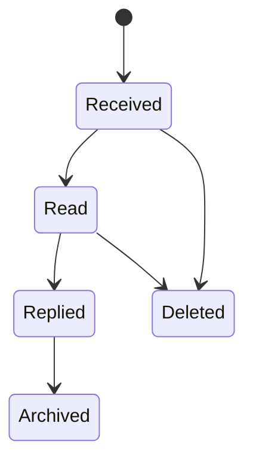
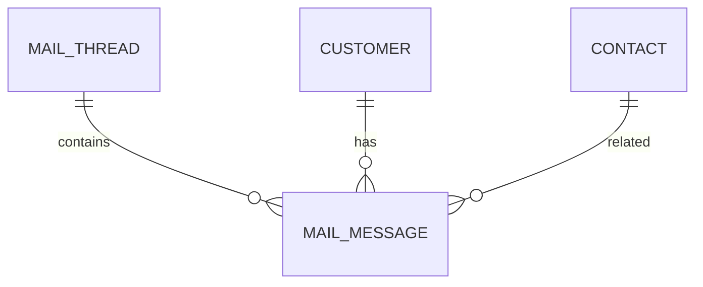

# MailMessage

Version: 1.0

Status: Draft

Priority: ★★★★★ (Core Domain)

---

# 1. 概要

MailMessageは、メールスレッド（MailThread）に属する個々のメールを管理するエンティティである。

送受信メールの本文、添付ファイル、AI解析結果を保持し、営業履歴・顧客対応・案件管理の基礎データとして利用する。

---

# 2. 責務

MailMessageは以下の責務を持つ。

- メール本文管理
- 添付ファイル管理
- 送受信履歴管理
- AI解析
- 営業履歴管理

---

# 3. ライフサイクル

---

# 4. テーブル定義

| Column | Type | Required | Description |
|---------|------|----------|-------------|
| id | UUID | ○ | 主キー |
| thread_id | UUID | ○ | MailThread ID |
| customer_id | UUID | ○ | Customer ID |
| contact_id | UUID | × | Contact ID |
| direction | MailDirection | ○ | 送受信区分 |
| message_id | VARCHAR(255) | ○ | Message-ID |
| subject | VARCHAR(500) | ○ | 件名 |
| sender_email | VARCHAR(255) | ○ | 差出人 |
| recipient_email | VARCHAR(255) | ○ | 宛先 |
| cc | JSON | × | CC一覧 |
| bcc | JSON | × | BCC一覧 |
| body_text | TEXT | ○ | プレーンテキスト |
| body_html | LONGTEXT | × | HTML本文 |
| attachment_count | INT | ○ | 添付数 |
| has_attachment | BOOLEAN | ○ | 添付有無 |
| sent_at | TIMESTAMP | ○ | 送受信日時 |
| is_read | BOOLEAN | ○ | 既読 |
| ai_summary | TEXT | × | AI要約 |
| ai_action | TEXT | × | AI推奨アクション |
| ai_sentiment | VARCHAR(50) | × | AI感情分析 |
| created_at | TIMESTAMP | ○ | 作成日時 |
| updated_at | TIMESTAMP | ○ | 更新日時 |
| deleted_at | TIMESTAMP | × | 論理削除 |

---

# 5. リレーション

---

# 6. Enum

## MailDirection

- Incoming
- Outgoing

---

# 7. 業務ルール

- MailThreadが存在する場合のみ登録可能
- Message-IDは一意とする
- 削除は論理削除のみ
- 添付ファイルはストレージで管理する

---

# 8. AI機能

AIは以下を支援する。

- メール要約
- 返信内容生成
- TODO抽出
- ネクストアクション抽出
- 感情分析
- クレーム検知
- 重要度判定
- スパム判定

---

# 9. API

| Method | Endpoint |
|---------|----------|
| GET | /mail-messages |
| GET | /mail-messages/{id} |
| POST | /mail-messages |
| PUT | /mail-messages/{id} |
| DELETE | /mail-messages/{id} |

---

# 10. Index

- thread_id
- customer_id
- contact_id
- message_id
- sender_email
- recipient_email
- sent_at

---

# 11. KPI

MailMessageから以下を集計する。

- 総送信数
- 総受信数
- 平均返信時間
- AI返信採用率
- 添付ファイル数
- クレーム件数

---

# 12. Prisma実装方針

Model名

MailMessage

Table名

mail_messages

UUIDを採用する。

MailThread・Customer・Contactとの外部キー制約を設定する。

message_idにはUnique制約を設定する。

---

# 13. 将来拡張

将来的に以下を追加する。

- 添付ファイルOCR
- AIによる返信自動送信
- Teams通知
- Slack通知
- Outlook連携
- Gmail連携
- 添付ファイルウイルスチェック
- AIによる重要メール自動分類
