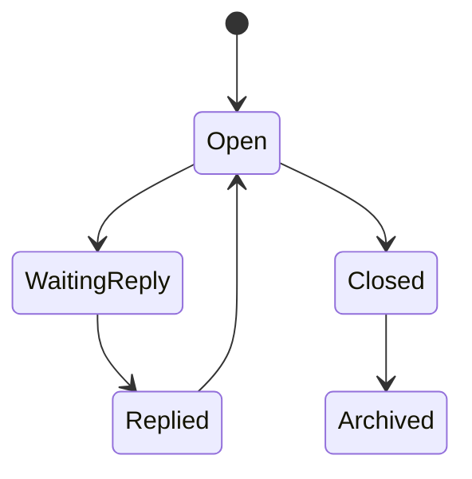
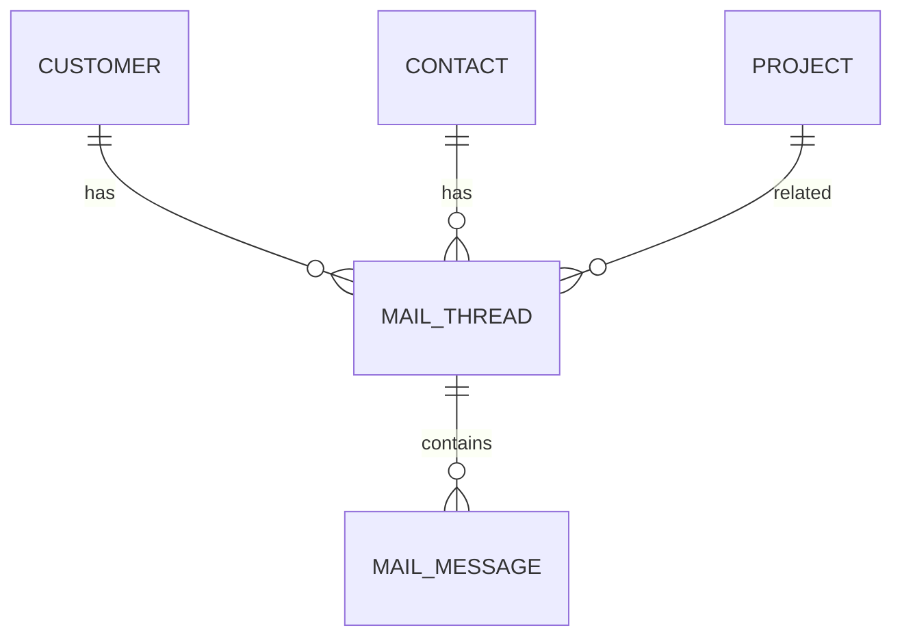

# MailThread

Version: 1.0

Status: Draft

Priority: ★★★★★ (Core Domain)

---

# 1. 概要

MailThreadは、顧客とのメールスレッド（会話単位）を管理するエンティティである。

複数のメール（MailMessage）を1つのスレッドとして管理し、AIによる返信支援・未返信管理・案件管理・営業履歴管理に利用する。

---

# 2. 責務

MailThreadは以下の責務を持つ。

- メールスレッド管理
- 顧客との会話履歴管理
- 未返信管理
- AI返信支援
- 案件との関連付け
- 営業活動履歴管理

---

# 3. ライフサイクル

---

# 4. テーブル定義

| Column | Type | Required | Description |
|---------|------|----------|-------------|
| id | UUID | ○ | 主キー |
| customer_id | UUID | ○ | Customer ID |
| contact_id | UUID | × | Contact ID |
| project_id | UUID | × | Project ID |
| subject | VARCHAR(500) | ○ | 件名 |
| thread_key | VARCHAR(255) | ○ | メールスレッド識別子 |
| last_message_at | TIMESTAMP | ○ | 最終メール日時 |
| unread_count | INT | ○ | 未読件数 |
| waiting_reply | BOOLEAN | ○ | 返信待ちフラグ |
| ai_summary | TEXT | × | AI要約 |
| ai_reply_draft | TEXT | × | AI返信下書き |
| priority | MailPriority | ○ | 優先度 |
| status | MailThreadStatus | ○ | 状態 |
| created_at | TIMESTAMP | ○ | 作成日時 |
| updated_at | TIMESTAMP | ○ | 更新日時 |
| deleted_at | TIMESTAMP | × | 論理削除 |

---

# 5. リレーション

---

# 6. Enum

## MailPriority

- Low
- Normal
- High
- Urgent

## MailThreadStatus

- Open
- WaitingReply
- Replied
- Closed
- Archived

---

# 7. 業務ルール

- Customerが存在する場合のみ登録可能
- スレッドIDは一意とする
- 未返信メールが存在する場合はWaitingReplyとする
- 削除は論理削除のみ

---

# 8. AI機能

AIは以下を支援する。

- メール要約
- 返信下書き作成
- 未返信メール検出
- 重要メール判定
- 感情分析
- フォロー漏れ検知
- 案件化可能性分析

---

# 9. API

| Method | Endpoint |
|---------|----------|
| GET | /mail-threads |
| GET | /mail-threads/{id} |
| POST | /mail-threads |
| PUT | /mail-threads/{id} |
| DELETE | /mail-threads/{id} |

---

# 10. Index

- customer_id
- contact_id
- project_id
- thread_key
- waiting_reply
- last_message_at
- status

---

# 11. KPI

MailThreadから以下を集計する。

- メール総件数
- 未返信件数
- 平均返信時間
- AI返信利用率
- フォロー漏れ件数
- 案件化率

---

# 12. Prisma実装方針

Model名

MailThread

Table名

mail_threads

UUIDを採用する。

Customer・Contact・Projectとの外部キー制約を設定する。

thread_keyにはUnique制約を設定する。

---

# 13. 将来拡張

将来的に以下を追加する。

- Gmail API連携
- Microsoft Graph API連携
- Outlook連携
- AI自動返信
- AI優先順位付け
- 添付ファイル解析
- メールテンプレート自動生成
- 自動ラベル分類
