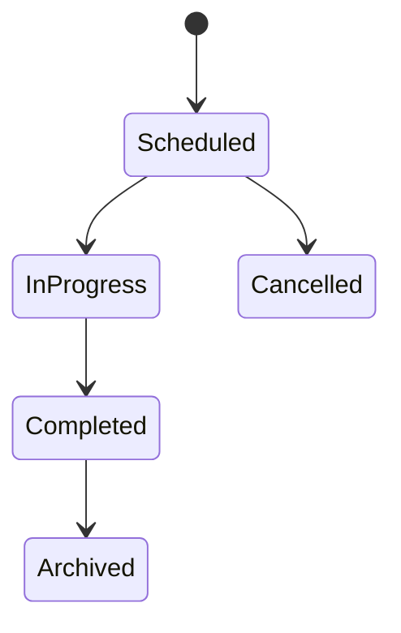
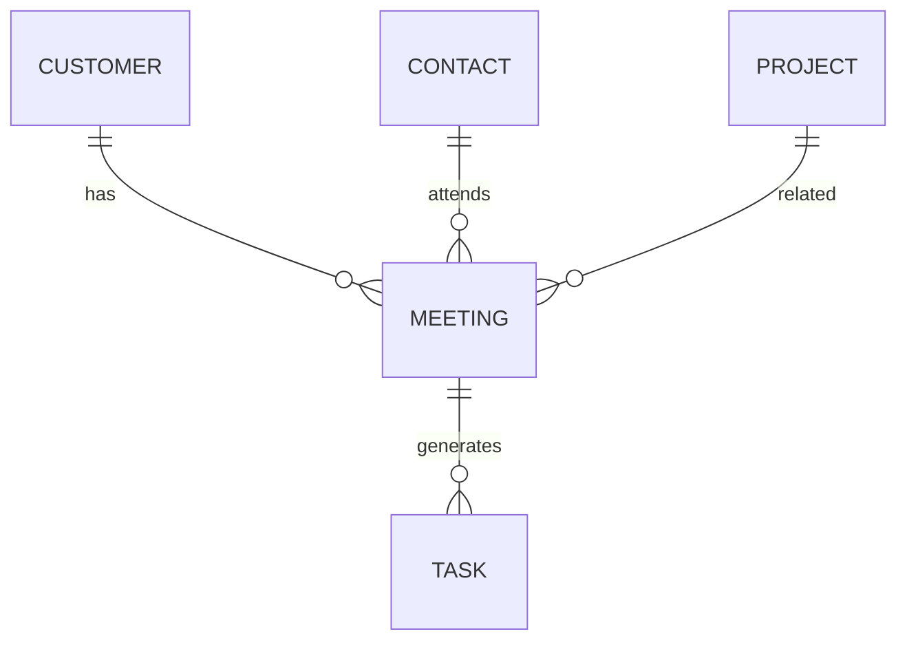

# Meeting

Version: 1.0

Status: Draft

Priority: ★★★★★ (Core Domain)

---

# 1. 概要

Meetingは、顧客との商談・打ち合わせ・オンライン会議・電話・訪問など、すべての営業活動を管理するエンティティである。

議事録、AI要約、TODO、メール履歴、案件情報と連携し、営業活動の中心データとして利用する。

---

# 2. 責務

Meetingは以下の責務を持つ。

- 商談情報管理
- 議事録管理
- 参加者管理
- AI要約管理
- TODO管理
- 営業履歴管理

---

# 3. ライフサイクル

---

# 4. テーブル定義

| Column | Type | Required | Description |
|---------|------|----------|-------------|
| id | UUID | ○ | 主キー |
| customer_id | UUID | ○ | Customer ID |
| contact_id | UUID | ○ | Contact ID |
| project_id | UUID | × | Project ID |
| title | VARCHAR(255) | ○ | 商談タイトル |
| meeting_type | MeetingType | ○ | 商談種別 |
| meeting_method | MeetingMethod | ○ | 実施方法 |
| scheduled_start | TIMESTAMP | ○ | 開始予定 |
| scheduled_end | TIMESTAMP | ○ | 終了予定 |
| actual_start | TIMESTAMP | × | 開始日時 |
| actual_end | TIMESTAMP | × | 終了日時 |
| location | VARCHAR(255) | × | 開催場所 |
| agenda | TEXT | × | アジェンダ |
| minutes | TEXT | × | 議事録 |
| ai_summary | TEXT | × | AI要約 |
| ai_next_action | TEXT | × | AI提案 |
| recording_url | VARCHAR(500) | × | 録画URL |
| transcript_url | VARCHAR(500) | × | 文字起こしURL |
| status | MeetingStatus | ○ | 状態 |
| created_by | UUID | ○ | 作成者 |
| created_at | TIMESTAMP | ○ | 作成日時 |
| updated_at | TIMESTAMP | ○ | 更新日時 |
| deleted_at | TIMESTAMP | × | 論理削除 |

---

# 5. リレーション

---

# 6. Enum

## MeetingType

- InitialMeeting
- Proposal
- Hearing
- RegularMeeting
- Negotiation
- Support
- InternalMeeting
- Other

## MeetingMethod

- Online
- Onsite
- Phone

## MeetingStatus

- Scheduled
- InProgress
- Completed
- Cancelled
- Archived

---

# 7. 業務ルール

- Customer・Contactが存在する場合のみ登録可能
- Completed以降は議事録入力を必須とする
- 削除は論理削除のみ
- AI要約は編集可能とする

---

# 8. AI機能

AIは以下を支援する。

- 音声文字起こし
- 議事録自動作成
- 要約作成
- TODO抽出
- 宿題抽出
- 次回提案内容作成
- フォローメール作成

---

# 9. API

| Method | Endpoint |
|---------|----------|
| GET | /meetings |
| GET | /meetings/{id} |
| POST | /meetings |
| PUT | /meetings/{id} |
| DELETE | /meetings/{id} |

---

# 10. Index

- customer_id
- contact_id
- project_id
- scheduled_start
- status
- created_by

---

# 11. KPI

Meetingから以下を集計する。

- 商談件数
- 商談時間
- 商談→案件化率
- 商談→受注率
- AI議事録作成率
- フォロー実施率

---

# 12. Prisma実装方針

Model名

Meeting

Table名

meetings

UUIDを採用する。

Customer・Contact・Projectとの外部キー制約を設定する。

---

# 13. 将来拡張

将来的に以下を追加する。

- Zoom連携
- Microsoft Teams連携
- Google Meet連携
- 録音データ自動取得
- カレンダー同期
- AI感情分析
- 商談品質分析
- 商談スコアリング
