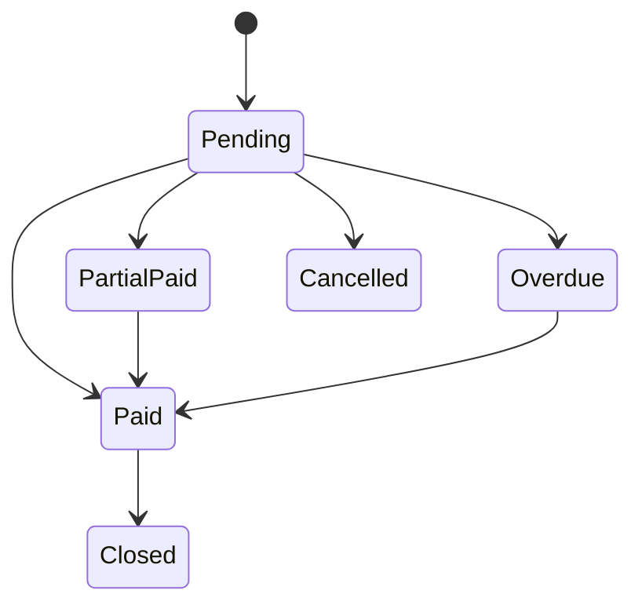
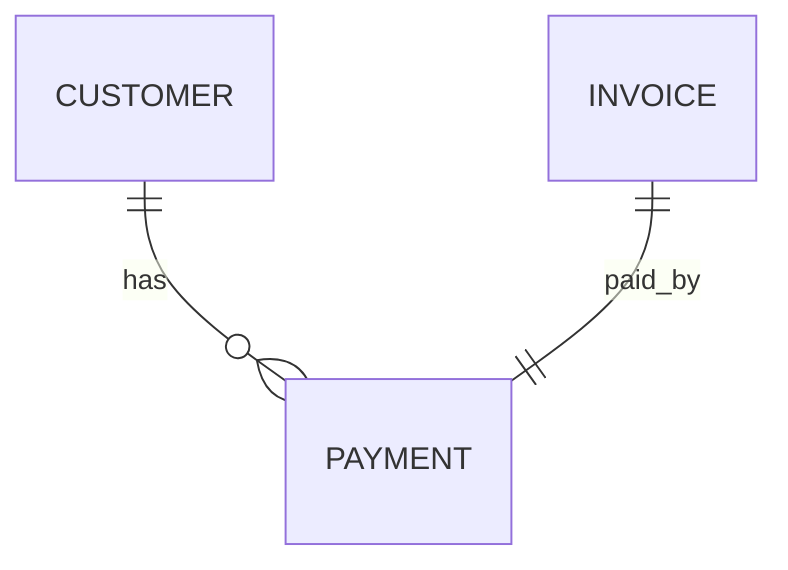

# Payment

Version: 1.0

Status: Draft

Priority: ★★★★★ (Core Domain)

---

# 1. 概要

Paymentは、請求書に対する入金情報を管理するエンティティである。

銀行振込・クレジットカード・その他の決済方法による入金を管理し、売掛金管理・キャッシュフロー分析・会計システム連携に利用する。

---

# 2. 責務

Paymentは以下の責務を持つ。

- 入金管理
- 入金日管理
- 入金金額管理
- 決済方法管理
- 消込管理
- AIによる未入金分析

---

# 3. ライフサイクル

---

# 4. テーブル定義

| Column | Type | Required | Description |
|---------|------|----------|-------------|
| id | UUID | ○ | 主キー |
| payment_no | VARCHAR(50) | ○ | 入金番号 |
| invoice_id | UUID | ○ | Invoice ID |
| customer_id | UUID | ○ | Customer ID |
| payment_status | PaymentStatus | ○ | 入金状態 |
| payment_method | PaymentMethod | ○ | 支払方法 |
| payment_date | DATE | × | 入金日 |
| due_date | DATE | ○ | 支払期限 |
| invoice_amount | DECIMAL(15,2) | ○ | 請求金額 |
| paid_amount | DECIMAL(15,2) | ○ | 入金金額 |
| remaining_amount | DECIMAL(15,2) | ○ | 未回収金額 |
| currency | VARCHAR(10) | ○ | 通貨 |
| transaction_no | VARCHAR(100) | × | 振込番号・取引番号 |
| bank_name | VARCHAR(200) | × | 金融機関名 |
| payment_reference | VARCHAR(255) | × | 支払参照番号 |
| notes | TEXT | × | 備考 |
| created_by | UUID | ○ | 作成者 |
| created_at | TIMESTAMP | ○ | 作成日時 |
| updated_at | TIMESTAMP | ○ | 更新日時 |
| deleted_at | TIMESTAMP | × | 論理削除 |

---

# 5. リレーション

---

# 6. Enum

## PaymentStatus

- Pending
- PartialPaid
- Paid
- Overdue
- Cancelled
- Closed

## PaymentMethod

- BankTransfer
- CreditCard
- Cash
- Stripe
- PayPal
- Other

---

# 7. 業務ルール

- Payment番号は自動採番する
- Invoiceが存在する場合のみ登録可能
- 入金額は請求金額を超えない
- 未回収金額は自動計算する
- 削除は論理削除のみ

---

# 8. AI機能

AIは以下を支援する。

- 未入金検知
- 督促対象抽出
- キャッシュフロー予測
- 入金遅延分析
- 回収率分析
- 売掛金分析

---

# 9. API

| Method | Endpoint |
|---------|----------|
| GET | /payments |
| GET | /payments/{id} |
| POST | /payments |
| PUT | /payments/{id} |
| DELETE | /payments/{id} |

---

# 10. Index

- payment_no
- invoice_id
- customer_id
- payment_status
- payment_date
- due_date

---

# 11. KPI

Paymentから以下を集計する。

- 入金件数
- 入金金額合計
- 回収率
- 未回収金額
- 平均入金日数
- 支払遅延件数

---

# 12. Prisma実装方針

Model名

Payment

Table名

payments

UUIDを採用する。

Customer・Invoiceとの外部キー制約を設定する。

payment_noにはUnique制約を設定する。

---

# 13. 将来拡張

将来的に以下を追加する。

- 銀行API連携
- freee連携
- マネーフォワード連携
- Stripe Webhook連携
- 自動消込
- AI入金予測
- AI督促タイミング最適化
- キャッシュフローダッシュボード
