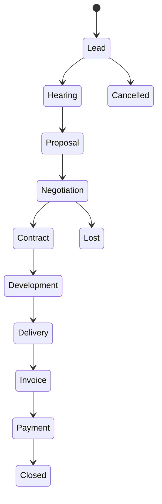
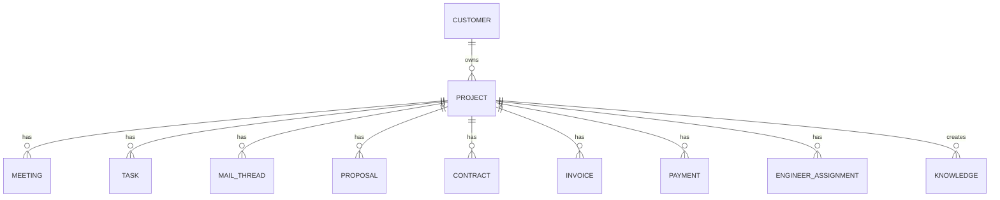

# Project

Version: 1.0

Status: Draft

Priority: ★★★★★ (Core Domain)

---

# 1. 概要

Project は VTaBridge OS の中心となるエンティティである。

営業活動、メール、議事録、タスク、見積、契約、請求、入金、エンジニア管理など、
すべての業務データは Project に紐付く。

Project は単なる案件ではなく、
Business Hub として機能する。

---

# 2. 責務

Project の責務は以下とする。

- 案件管理
- 顧客管理との関連付け
- 営業進捗管理
- AI要約管理
- タスク管理
- エンジニア管理
- 契約管理
- 売上管理
- 利益管理

---

# 3. Projectライフサイクル

---

# 4. テーブル定義

| Column | Type | Required | Description |
|---------|------|----------|-------------|
| id | UUID | ○ | 主キー |
| project_number | VARCHAR(30) | ○ | 案件番号 |
| customer_id | UUID | ○ | 顧客ID |
| project_name | VARCHAR(255) | ○ | 案件名 |
| project_summary | TEXT | × | 案件概要 |
| status | ProjectStatus | ○ | 状態 |
| priority | Priority | ○ | 優先度 |
| sales_user_id | UUID | ○ | 営業担当 |
| project_manager_id | UUID | × | PM |
| expected_amount | DECIMAL(12,2) | × | 見込金額 |
| contract_amount | DECIMAL(12,2) | × | 契約金額 |
| estimated_cost | DECIMAL(12,2) | × | 原価予定 |
| expected_profit | DECIMAL(12,2) | × | 見込利益 |
| start_date | DATE | × | 開始予定 |
| end_date | DATE | × | 終了予定 |
| contract_date | DATE | × | 契約日 |
| ai_summary | TEXT | × | AI要約 |
| created_at | TIMESTAMP | ○ | 作成日時 |
| updated_at | TIMESTAMP | ○ | 更新日時 |
| deleted_at | TIMESTAMP | × | 論理削除 |

---

# 5. リレーション

Project がすべての業務データの親となる。

---

# 6. Enum

## ProjectStatus

- Lead
- Hearing
- Proposal
- Negotiation
- Contract
- Development
- Delivery
- Invoice
- Payment
- Closed
- Lost
- Cancelled

---

## Priority

- Low
- Normal
- High
- Critical

---

# 7. 業務ルール

- 案件番号は自動採番する
- 顧客が存在しなければ案件は作成できない
- 削除は論理削除のみ
- 案件終了後も履歴は保持する
- 金額変更は監査ログへ保存する

---

# 8. AI利用

AIは以下を実施する。

- 案件要約
- 商談分析
- リスク分析
- TODO抽出
- メール下書き
- 見積ドラフト作成
- 次回アクション提案

AIは契約内容を変更してはならない。

---

# 9. API予定

| Method | Endpoint |
|---------|----------|
| GET | /projects |
| GET | /projects/{id} |
| POST | /projects |
| PUT | /projects/{id} |
| DELETE | /projects/{id} |

---

# 10. Index

- customer_id
- sales_user_id
- status
- project_number
- created_at

---

# 11. KPI

Projectから以下を集計する。

- 受注率
- 失注率
- 平均契約単価
- 平均利益率
- 売上予測
- AI案件スコア

---

# 12. Prisma実装方針

Model

Project

Table

projects

UUID採用

ProjectNumberはUnique

---

# 13. 将来拡張

将来的に以下を追加する。

- Slack連携
- Teams連携
- GitHub連携
- Backlog連携
- Jira連携
- Redmine連携
- 契約更新通知
- AI案件評価
- AIリスクスコア
