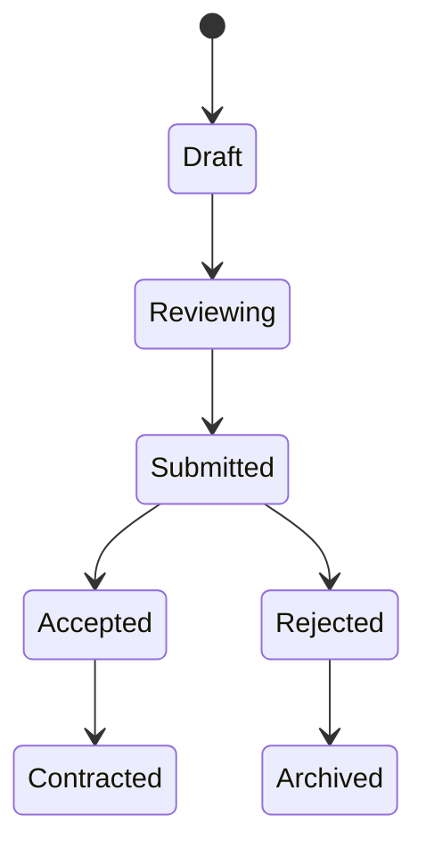
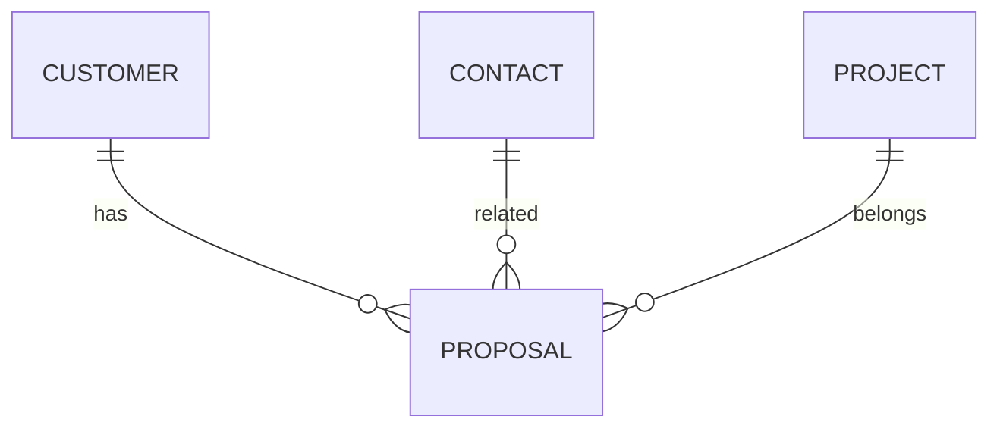

# Proposal

Version: 1.0

Status: Draft

Priority: ★★★★★ (Core Domain)

---

# 1. 概要

Proposalは、顧客へ提出する提案書および見積情報を管理するエンティティである。

営業担当が作成した提案内容、金額、提出日、AIによる提案書生成履歴を管理し、案件受注率の分析にも利用する。

---

# 2. 責務

Proposalは以下の責務を持つ。

- 提案書管理
- 見積管理
- 金額管理
- 提案ステータス管理
- AI提案書生成履歴管理
- 受注分析

---

# 3. ライフサイクル

---

# 4. テーブル定義

| Column | Type | Required | Description |
|---------|------|----------|-------------|
| id | UUID | ○ | 主キー |
| proposal_no | VARCHAR(50) | ○ | 提案番号 |
| customer_id | UUID | ○ | Customer ID |
| contact_id | UUID | × | Contact ID |
| project_id | UUID | × | Project ID |
| title | VARCHAR(255) | ○ | 提案名 |
| proposal_status | ProposalStatus | ○ | 提案状態 |
| version | INT | ○ | バージョン |
| total_amount | DECIMAL(15,2) | ○ | 提案金額 |
| currency | VARCHAR(10) | ○ | 通貨 |
| submitted_at | TIMESTAMP | × | 提出日時 |
| valid_until | DATE | × | 見積有効期限 |
| acceptance_date | DATE | × | 受注日 |
| proposal_file | VARCHAR(500) | × | 提案書ファイル |
| quotation_file | VARCHAR(500) | × | 見積書ファイル |
| ai_summary | TEXT | × | AI要約 |
| notes | TEXT | × | 備考 |
| created_by | UUID | ○ | 作成者 |
| created_at | TIMESTAMP | ○ | 作成日時 |
| updated_at | TIMESTAMP | ○ | 更新日時 |
| deleted_at | TIMESTAMP | × | 論理削除 |

---

# 5. リレーション

---

# 6. Enum

## ProposalStatus

- Draft
- Reviewing
- Submitted
- Accepted
- Rejected
- Contracted
- Archived

---

# 7. 業務ルール

- Proposal番号は自動採番する
- Customerが存在する場合のみ登録可能
- 提出後は履歴を保持する
- 削除は論理削除のみ
- バージョン管理を行う

---

# 8. AI機能

AIは以下を支援する。

- 提案書自動作成
- 見積書作成
- 提案内容要約
- 提案内容改善
- 受注確率予測
- 提案漏れ検知

---

# 9. API

| Method | Endpoint |
|---------|----------|
| GET | /proposals |
| GET | /proposals/{id} |
| POST | /proposals |
| PUT | /proposals/{id} |
| DELETE | /proposals/{id} |

---

# 10. Index

- proposal_no
- customer_id
- project_id
- proposal_status
- submitted_at

---

# 11. KPI

Proposalから以下を集計する。

- 提案件数
- 提案金額合計
- 平均提案金額
- 受注率
- 提案から受注までの平均日数
- AI提案利用率

---

# 12. Prisma実装方針

Model名

Proposal

Table名

proposals

UUIDを採用する。

Customer・Contact・Projectとの外部キー制約を設定する。

proposal_noにはUnique制約を設定する。

---

# 13. 将来拡張

将来的に以下を追加する。

- Word自動生成
- PDF自動生成
- 電子署名連携
- DocuSign連携
- AI価格最適化
- AI提案書レビュー
- 提案テンプレート管理
- 電子送付履歴管理
