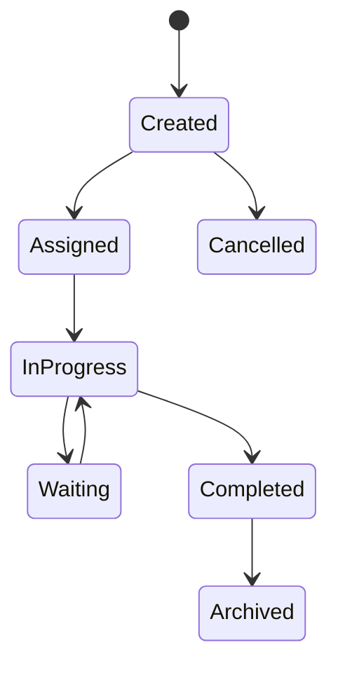
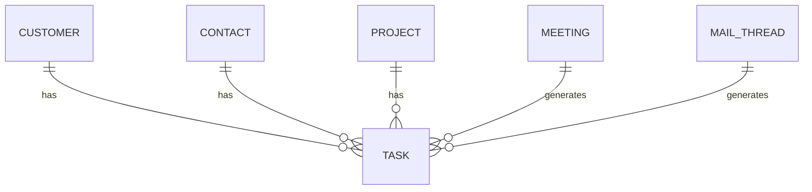

# Task

Version: 1.0

Status: Draft

Priority: ★★★★★ (Core Domain)

---

# 1. 概要

Taskは、営業活動・案件・商談・メール・AIから生成されるすべてのタスクを管理するエンティティである。

営業担当のTODO管理だけではなく、AIが抽出したタスクやRPAが実行待ちとなる処理も管理対象とする。

VTaBridge OSにおける業務実行の中心となるエンティティである。

---

# 2. 責務

Taskは以下の責務を持つ。

- TODO管理
- 営業タスク管理
- AIタスク管理
- RPA実行管理
- 期限管理
- ステータス管理

---

# 3. ライフサイクル

---

# 4. テーブル定義

| Column | Type | Required | Description |
|---------|------|----------|-------------|
| id | UUID | ○ | 主キー |
| task_no | VARCHAR(50) | ○ | タスク番号 |
| customer_id | UUID | × | Customer ID |
| contact_id | UUID | × | Contact ID |
| project_id | UUID | × | Project ID |
| meeting_id | UUID | × | Meeting ID |
| mail_thread_id | UUID | × | MailThread ID |
| assigned_user_id | UUID | ○ | 担当者 |
| created_by | UUID | ○ | 作成者 |
| task_type | TaskType | ○ | タスク種別 |
| priority | TaskPriority | ○ | 優先度 |
| status | TaskStatus | ○ | 状態 |
| title | VARCHAR(255) | ○ | タイトル |
| description | TEXT | × | 詳細 |
| due_date | TIMESTAMP | × | 期限 |
| completed_at | TIMESTAMP | × | 完了日時 |
| ai_generated | BOOLEAN | ○ | AI生成フラグ |
| rpa_target | BOOLEAN | ○ | RPA対象 |
| reminder_sent | BOOLEAN | ○ | リマインダー送信済 |
| created_at | TIMESTAMP | ○ | 作成日時 |
| updated_at | TIMESTAMP | ○ | 更新日時 |
| deleted_at | TIMESTAMP | × | 論理削除 |

---

# 5. リレーション

---

# 6. Enum

## TaskType

- Meeting
- Mail
- Proposal
- Contract
- Invoice
- Payment
- FollowUp
- Reminder
- Internal
- AI
- RPA
- Other

## TaskPriority

- Low
- Normal
- High
- Critical

## TaskStatus

- Created
- Assigned
- InProgress
- Waiting
- Completed
- Cancelled
- Archived

---

# 7. 業務ルール

- Task番号は自動採番する
- AI生成タスクは担当者が確認後にAssignedへ変更する
- 完了時はcompleted_atを自動更新する
- 削除は論理削除のみ
- 期限超過はOverdueとしてダッシュボードへ表示する

---

# 8. AI機能

AIは以下を支援する。

- 議事録からTODO抽出
- メールからTODO抽出
- 優先順位付け
- 期限提案
- リスク検知
- フォロー漏れ検知
- タスク自動生成
- タスク要約

---

# 9. API

| Method | Endpoint |
|---------|----------|
| GET | /tasks |
| GET | /tasks/{id} |
| POST | /tasks |
| PUT | /tasks/{id} |
| DELETE | /tasks/{id} |

---

# 10. Index

- task_no
- assigned_user_id
- customer_id
- project_id
- status
- priority
- due_date

---

# 11. KPI

Taskから以下を集計する。

- タスク総数
- 完了率
- AI生成タスク数
- 期限超過件数
- 平均完了日数
- 担当者別完了率
- フォロー漏れ件数

---

# 12. Prisma実装方針

Model名

Task

Table名

tasks

UUIDを採用する。

Customer・Contact・Project・Meeting・MailThreadとの外部キー制約を設定する。

task_noにはUnique制約を設定する。

---

# 13. 将来拡張

将来的に以下を追加する。

- Google Calendar連携
- Outlook Calendar連携
- Slack通知
- Microsoft Teams通知
- AIによる自動優先順位変更
- AIによる担当者割り当て
- RPA自動実行
- ガントチャート表示
