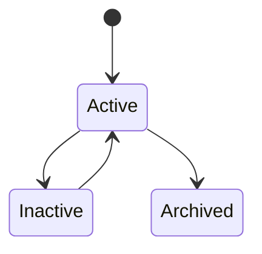
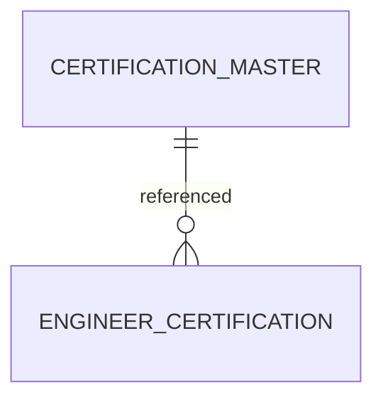

# CertificationMaster

Version: 1.0

Status: Draft

Priority: ★★★★★ (Master Data)

---

# 1. 概要

CertificationMasterは、VTaBridge OSで管理する資格情報のマスタである。

IT資格、語学資格、国家資格、ベンダー資格などを統一管理し、エンジニア情報・案件要件・AIマッチングで利用する。

---

# 2. 責務

CertificationMasterは以下を管理する。

- 資格情報
- 資格分類
- 認定機関
- 有効期限有無
- AI判定情報

---

# 3. ライフサイクル

---

# 4. テーブル定義

| Column | Type | Required | Description |
|---------|------|----------|-------------|
| id | UUID | ○ | 主キー |
| certification_code | VARCHAR(50) | ○ | 資格コード |
| certification_name | VARCHAR(255) | ○ | 資格名 |
| display_name | VARCHAR(255) | ○ | 表示名 |
| category | CertificationCategory | ○ | 資格カテゴリ |
| vendor | VARCHAR(200) | × | ベンダー・認定機関 |
| description | TEXT | × | 資格説明 |
| validity_period_months | INT | × | 有効期間（月） |
| renewable | BOOLEAN | ○ | 更新可否 |
| level | VARCHAR(100) | × | 難易度 |
| keywords | JSON | × | AI検索キーワード |
| status | MasterStatus | ○ | 状態 |
| sort_order | INT | ○ | 表示順 |
| created_at | TIMESTAMP | ○ | 作成日時 |
| updated_at | TIMESTAMP | ○ | 更新日時 |
| deleted_at | TIMESTAMP | × | 論理削除 |

---

# 5. リレーション

---

# 6. Enum

## CertificationCategory

- Programming
- Cloud
- Network
- Security
- Database
- AI
- Language
- ProjectManagement
- National
- Other

## MasterStatus

- Active
- Inactive
- Archived

---

# 7. 業務ルール

- 資格コードは一意とする
- 資格名の重複は禁止
- 削除は論理削除のみ
- 無効資格はInactiveとする

---

# 8. AI機能

AIは以下を支援する。

- 資格分類
- 推奨資格提案
- 人気資格分析
- 市場需要分析
- キャリアロードマップ作成
- 類似資格推薦

---

# 9. API

| Method | Endpoint |
|---------|----------|
| GET | /master/certifications |
| GET | /master/certifications/{id} |
| POST | /master/certifications |
| PUT | /master/certifications/{id} |
| DELETE | /master/certifications/{id} |

---

# 10. Index

- certification_code
- certification_name
- category
- vendor
- status

---

# 11. KPI

CertificationMasterから以下を集計する。

- 登録資格数
- カテゴリ別資格数
- ベンダー別資格数
- 人気資格ランキング
- 利用率ランキング

---

# 12. Prisma実装方針

Model名

CertificationMaster

Table名

certification_master

UUIDを採用する。

certification_codeにはUnique制約を設定する。

certification_nameにもUnique制約を設定する。

---

# 13. 将来拡張

将来的に以下を追加する。

- Credly API連携
- Microsoft Learn連携
- AWS Certification連携
- Google Cloud Certification連携
- AIによる資格市場分析
- AIによる資格推奨
