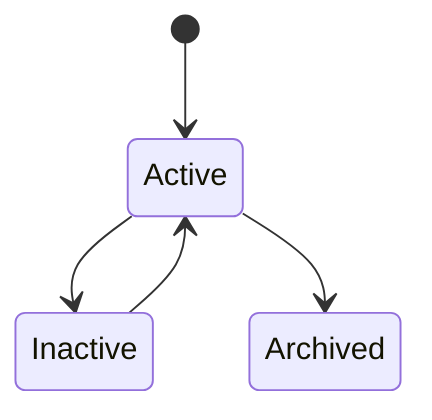
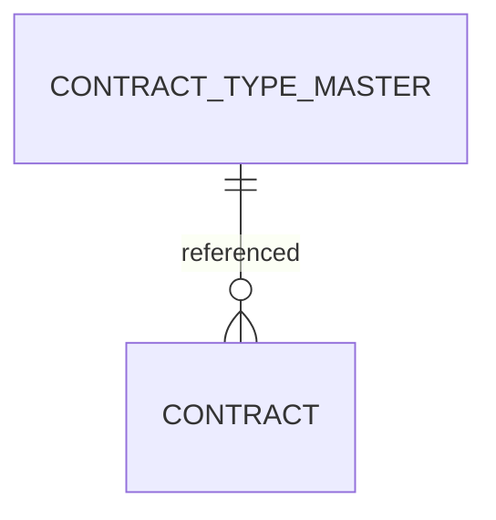

# ContractTypeMaster

Version: 1.0

Status: Draft

Priority: ★★★★★ (Master Data)

---

# 1. 概要

ContractTypeMasterは、VTaBridge OSで利用する契約種別を管理するマスタである。

SES契約、業務委託契約、派遣契約、保守契約、サブスクリプション契約などを統一管理し、契約・請求・売上分析で利用する。

---

# 2. 責務

ContractTypeMasterは以下を管理する。

- 契約種別
- 契約コード
- 契約区分
- 契約説明
- 利用状態

---

# 3. ライフサイクル

---

# 4. テーブル定義

| Column | Type | Required | Description |
|---------|------|----------|-------------|
| id | UUID | ○ | 主キー |
| contract_type_code | VARCHAR(50) | ○ | 契約種別コード |
| contract_type_name | VARCHAR(100) | ○ | 契約種別名 |
| category | VARCHAR(100) | ○ | 契約カテゴリ |
| description | TEXT | × | 説明 |
| requires_invoice | BOOLEAN | ○ | 請求書発行要否 |
| auto_renew_supported | BOOLEAN | ○ | 自動更新対応 |
| status | MasterStatus | ○ | 状態 |
| sort_order | INT | ○ | 表示順 |
| created_at | TIMESTAMP | ○ | 作成日時 |
| updated_at | TIMESTAMP | ○ | 更新日時 |
| deleted_at | TIMESTAMP | × | 論理削除 |

---

# 5. リレーション

---

# 6. Enum

## MasterStatus

- Active
- Inactive
- Archived

---

# 7. 業務ルール

- contract_type_codeは一意とする
- contract_type_nameは重複不可
- 削除は論理削除のみ
- 利用停止はInactiveとする

---

# 8. AI機能

AIは以下を支援する。

- 契約種別推定
- 契約内容分析
- 契約テンプレート提案
- 契約更新提案
- 契約リスク分析
- 契約収益分析

---

# 9. API

| Method | Endpoint |
|---------|----------|
| GET | /master/contract-types |
| GET | /master/contract-types/{id} |
| POST | /master/contract-types |
| PUT | /master/contract-types/{id} |
| DELETE | /master/contract-types/{id} |

---

# 10. Index

- contract_type_code
- contract_type_name
- category
- status

---

# 11. KPI

ContractTypeMasterから以下を集計する。

- 契約種別数
- 契約件数（種別別）
- 売上（契約種別別）
- 更新率（契約種別別）
- 利益率（契約種別別）

---

# 12. Prisma実装方針

Model名

ContractTypeMaster

Table名

contract_type_master

UUIDを採用する。

contract_type_codeにはUnique制約を設定する。

contract_type_nameにもUnique制約を設定する。

---

# 13. 将来拡張

将来的に以下を追加する。

- 電子契約サービス連携
- AI契約書分類
- AI契約更新予測
- 契約テンプレート管理
- 契約自動生成
- 契約分析ダッシュボード
