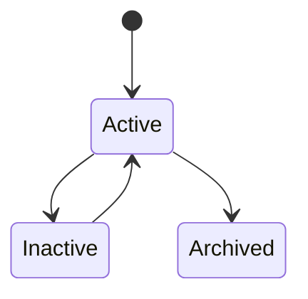
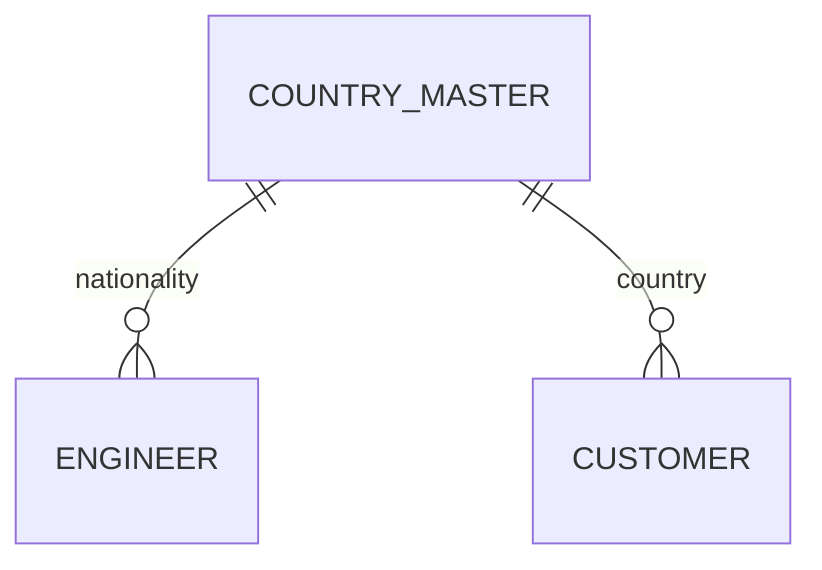

# CountryMaster

Version: 1.0

Status: Draft

Priority: ★★★★★ (Master Data)

---

# 1. 概要

CountryMasterは、VTaBridge OSで利用する国・地域情報を管理するマスタである。

エンジニアの居住国、顧客所在地、案件実施国、税制・通貨・タイムゾーンなどの基準情報として利用する。

---

# 2. 責務

CountryMasterは以下を管理する。

- 国情報
- ISO国コード
- 通貨
- タイムゾーン
- 地域
- AI分析用情報

---

# 3. ライフサイクル

---

# 4. テーブル定義

| Column | Type | Required | Description |
|---------|------|----------|-------------|
| id | UUID | ○ | 主キー |
| country_code | CHAR(2) | ○ | ISO3166-1 Alpha-2 |
| country_code3 | CHAR(3) | ○ | ISO3166-1 Alpha-3 |
| country_name | VARCHAR(150) | ○ | 国名 |
| english_name | VARCHAR(150) | ○ | 英語名 |
| native_name | VARCHAR(150) | × | 現地名 |
| region | VARCHAR(100) | ○ | 地域 |
| currency_code | CHAR(3) | ○ | ISO4217通貨コード |
| timezone | VARCHAR(100) | ○ | タイムゾーン |
| phone_code | VARCHAR(10) | × | 国番号 |
| description | TEXT | × | 説明 |
| status | MasterStatus | ○ | 状態 |
| sort_order | INT | ○ | 表示順 |
| created_at | TIMESTAMP | ○ | 作成日時 |
| updated_at | TIMESTAMP | ○ | 更新日時 |
| deleted_at | TIMESTAMP | × | 論理削除 |

---

# 5. リレーション

---

# 6. Enum

## MasterStatus

- Active
- Inactive
- Archived

---

# 7. 業務ルール

- country_codeはISO3166-1 Alpha-2に準拠する
- country_code3はISO3166-1 Alpha-3に準拠する
- country_codeは一意とする
- country_nameは重複不可
- 削除は論理削除のみ

---

# 8. AI機能

AIは以下を支援する。

- 海外案件分析
- 国別エンジニア分析
- 地域別需要予測
- 時差考慮スケジューリング
- 多言語マッチング
- 海外市場分析

---

# 9. API

| Method | Endpoint |
|---------|----------|
| GET | /master/countries |
| GET | /master/countries/{id} |
| POST | /master/countries |
| PUT | /master/countries/{id} |
| DELETE | /master/countries/{id} |

---

# 10. Index

- country_code
- country_code3
- country_name
- region
- currency_code
- status

---

# 11. KPI

CountryMasterから以下を集計する。

- 登録国数
- 地域別国数
- エンジニア所属国数
- 顧客所在国数
- 国別案件数

---

# 12. Prisma実装方針

Model名

CountryMaster

Table名

country_master

UUIDを採用する。

country_codeにはUnique制約を設定する。

country_code3にはUnique制約を設定する。

country_nameにもUnique制約を設定する。

---

# 13. 将来拡張

将来的に以下を追加する。

- ISOデータ自動同期
- 為替レートAPI連携
- 祝日API連携
- タイムゾーン自動更新
- AI海外市場分析
- AI国別リスク分析
