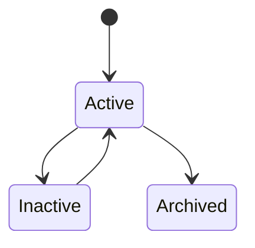
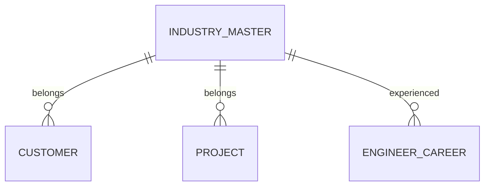

# IndustryMaster

Version: 1.0

Status: Draft

Priority: ★★★★★ (Master Data)

---

# 1. 概要

IndustryMasterは、VTaBridge OSで利用する業界情報を管理するマスタである。

顧客企業、案件、エンジニアの業界経験を統一的に分類し、営業分析・AIマッチング・市場分析の基盤データとして利用する。

---

# 2. 責務

IndustryMasterは以下を管理する。

- 業界情報
- 業界コード
- 業界分類
- 親子カテゴリ
- AI分析用情報

---

# 3. ライフサイクル

---

# 4. テーブル定義

| Column | Type | Required | Description |
|---------|------|----------|-------------|
| id | UUID | ○ | 主キー |
| industry_code | VARCHAR(50) | ○ | 業界コード |
| industry_name | VARCHAR(200) | ○ | 業界名 |
| parent_industry_id | UUID | × | 親業界 |
| description | TEXT | × | 説明 |
| keywords | JSON | × | AI検索キーワード |
| status | MasterStatus | ○ | 状態 |
| sort_order | INT | ○ | 表示順 |
| created_at | TIMESTAMP | ○ | 作成日時 |
| updated_at | TIMESTAMP | ○ | 更新日時 |
| deleted_at | TIMESTAMP | × | 論理削除 |

---

# 5. リレーション

---

# 6. Enum

## MasterStatus

- Active
- Inactive
- Archived

---

# 7. 業務ルール

- industry_codeは一意とする
- industry_nameは重複不可
- 親業界による階層管理を可能とする
- 削除は論理削除のみ

---

# 8. AI機能

AIは以下を支援する。

- 業界分類
- 類似業界判定
- 市場分析
- 業界トレンド分析
- 業界別案件分析
- 業界別人材需要予測

---

# 9. API

| Method | Endpoint |
|---------|----------|
| GET | /master/industries |
| GET | /master/industries/{id} |
| POST | /master/industries |
| PUT | /master/industries/{id} |
| DELETE | /master/industries/{id} |

---

# 10. Index

- industry_code
- industry_name
- parent_industry_id
- status

---

# 11. KPI

IndustryMasterから以下を集計する。

- 登録業界数
- 顧客数（業界別）
- 案件数（業界別）
- エンジニア経験数（業界別）
- 売上ランキング（業界別）

---

# 12. Prisma実装方針

Model名

IndustryMaster

Table名

industry_master

UUIDを採用する。

parent_industry_idは自己参照の外部キー制約を設定する。

industry_codeにはUnique制約を設定する。

industry_nameにもUnique制約を設定する。

---

# 13. 将来拡張

将来的に以下を追加する。

- 日本標準産業分類対応
- NAICS対応
- SICコード対応
- AI市場分析
- AI業界成長予測
- AI営業ターゲット分析
