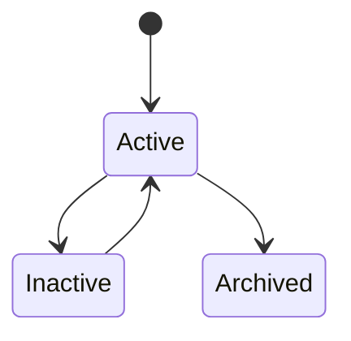
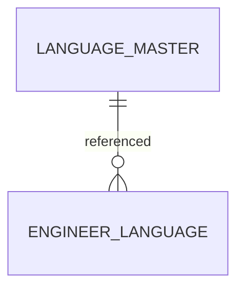

# LanguageMaster

Version: 1.0

Status: Draft

Priority: ★★★★★ (Master Data)

---

# 1. 概要

LanguageMasterは、VTaBridge OSで管理する言語情報のマスタである。

エンジニアの語学力、案件で必要となる言語要件、AIによるエンジニアマッチングで利用する。

---

# 2. 責務

LanguageMasterは以下を管理する。

- 言語情報
- ISO言語コード
- 表示名
- 地域
- AI検索キーワード

---

# 3. ライフサイクル

---

# 4. テーブル定義

| Column | Type | Required | Description |
|---------|------|----------|-------------|
| id | UUID | ○ | 主キー |
| language_code | VARCHAR(20) | ○ | ISO言語コード |
| language_name | VARCHAR(100) | ○ | 言語名 |
| native_name | VARCHAR(100) | × | 現地表記 |
| english_name | VARCHAR(100) | × | 英語表記 |
| region | VARCHAR(100) | × | 主な利用地域 |
| description | TEXT | × | 説明 |
| keywords | JSON | × | AI検索キーワード |
| status | MasterStatus | ○ | 状態 |
| sort_order | INT | ○ | 表示順 |
| created_at | TIMESTAMP | ○ | 作成日時 |
| updated_at | TIMESTAMP | ○ | 更新日時 |
| deleted_at | TIMESTAMP | × | 論理削除 |

---

# 5. リレーション

---

# 6. Enum

## MasterStatus

- Active
- Inactive
- Archived

---

# 7. 業務ルール

- language_codeはISO 639-1またはISO 639-3に準拠する
- language_codeは一意とする
- language_nameは重複不可
- 削除は論理削除のみ

---

# 8. AI機能

AIは以下を支援する。

- 類似言語判定
- 翻訳候補提案
- 言語マッチング
- 多言語検索
- 地域別分析
- AI翻訳支援

---

# 9. API

| Method | Endpoint |
|---------|----------|
| GET | /master/languages |
| GET | /master/languages/{id} |
| POST | /master/languages |
| PUT | /master/languages/{id} |
| DELETE | /master/languages/{id} |

---

# 10. Index

- language_code
- language_name
- region
- status

---

# 11. KPI

LanguageMasterから以下を集計する。

- 登録言語数
- 地域別言語数
- エンジニア保有言語数
- 人気言語ランキング
- 案件要求言語ランキング

---

# 12. Prisma実装方針

Model名

LanguageMaster

Table名

language_master

UUIDを採用する。

language_codeにはUnique制約を設定する。

language_nameにもUnique制約を設定する。

---

# 13. 将来拡張

将来的に以下を追加する。

- CEFRレベル連携
- JLPTマスタ連携
- TOEIC・IELTS・TOEFLマスタ連携
- AI自動翻訳
- AI言語需要分析
- AIグローバル案件マッチング
