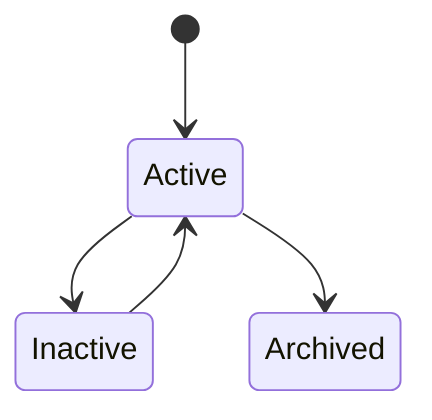
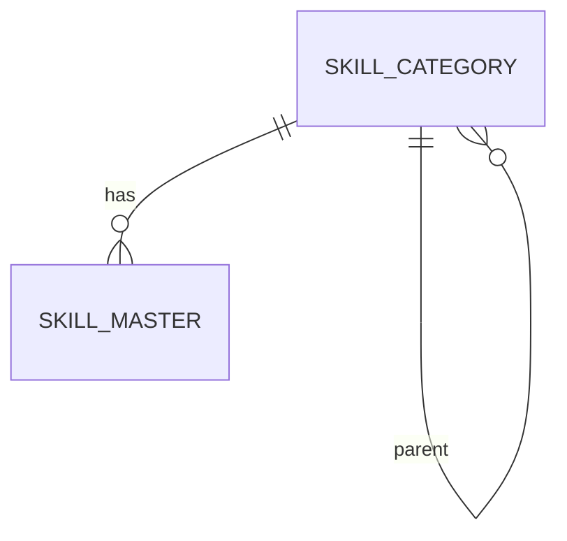

# SkillCategory

Version: 1.0

Status: Draft

Priority: ★★★★★ (Master Data)

---

# 1. 概要

SkillCategoryは、VTaBridge OSで管理するスキルのカテゴリを管理するマスタである。

プログラミング言語、クラウド、データベース、AI、ネットワークなどの分類を統一し、スキル検索・AIマッチング・分析の基準として利用する。

---

# 2. 責務

SkillCategoryは以下を管理する。

- スキルカテゴリ
- 表示順
- 親カテゴリ
- 説明
- 利用状態

---

# 3. ライフサイクル

---

# 4. テーブル定義

| Column | Type | Required | Description |
|---------|------|----------|-------------|
| id | UUID | ○ | 主キー |
| category_code | VARCHAR(50) | ○ | カテゴリコード |
| category_name | VARCHAR(200) | ○ | カテゴリ名 |
| parent_category_id | UUID | × | 親カテゴリ |
| description | TEXT | × | 説明 |
| sort_order | INT | ○ | 表示順 |
| status | CategoryStatus | ○ | 状態 |
| created_at | TIMESTAMP | ○ | 作成日時 |
| updated_at | TIMESTAMP | ○ | 更新日時 |
| deleted_at | TIMESTAMP | × | 論理削除 |

---

# 5. リレーション

---

# 6. Enum

## CategoryStatus

- Active
- Inactive
- Archived

---

# 7. 業務ルール

- カテゴリコードは一意とする
- 親カテゴリは任意
- 最大5階層まで登録可能
- 削除は論理削除のみ

---

# 8. AI機能

AIは以下を支援する。

- カテゴリ自動分類
- 新カテゴリ提案
- カテゴリ統合提案
- 利用頻度分析
- スキルマップ生成

---

# 9. API

| Method | Endpoint |
|---------|----------|
| GET | /master/skill-categories |
| GET | /master/skill-categories/{id} |
| POST | /master/skill-categories |
| PUT | /master/skill-categories/{id} |
| DELETE | /master/skill-categories/{id} |

---

# 10. Index

- category_code
- category_name
- parent_category_id
- status

---

# 11. KPI

SkillCategoryから以下を集計する。

- カテゴリ数
- スキル登録数
- カテゴリ別利用率
- 人気カテゴリランキング

---

# 12. Prisma実装方針

Model名

SkillCategory

Table名

skill_categories

UUIDを採用する。

自己参照（parent_category_id）の外部キー制約を設定する。

category_codeにはUnique制約を設定する。

category_nameにもUnique制約を設定する。

---

# 13. 将来拡張

将来的に以下を追加する。

- AIによるカテゴリ最適化
- 市場動向分析
- 自動カテゴリ統合
- カテゴリ利用履歴分析
- スキルツリー可視化
- AIスキルマップ生成
