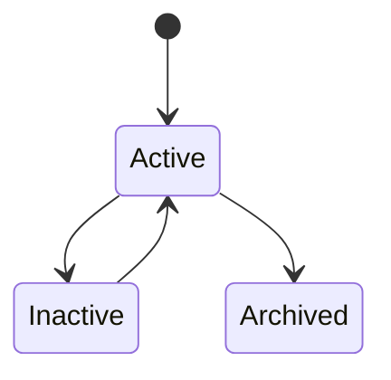
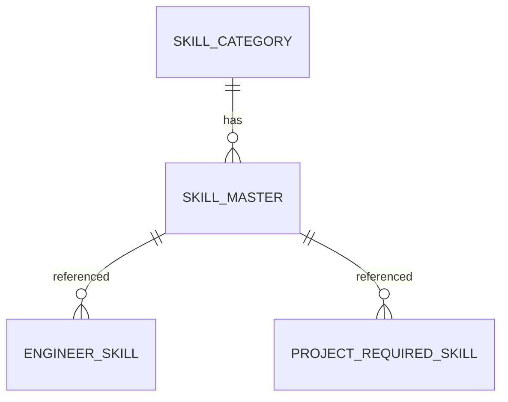

# SkillMaster

Version: 1.0

Status: Draft

Priority: ★★★★★ (Master Data)

---

# 1. 概要

SkillMasterは、VTaBridge OSで利用する技術スキルを管理するマスタである。

エンジニアが保有するスキル、案件で必要となるスキル、AIによるスキルマッチングで共通利用する。

---

# 2. 責務

SkillMasterは以下を管理する。

- 技術スキル
- スキルカテゴリ
- スキル表示名
- スキル説明
- AI検索キーワード

---

# 3. ライフサイクル

---

# 4. テーブル定義

| Column | Type | Required | Description |
|---------|------|----------|-------------|
| id | UUID | ○ | 主キー |
| category_id | UUID | ○ | SkillCategory ID |
| skill_code | VARCHAR(50) | ○ | スキルコード |
| skill_name | VARCHAR(200) | ○ | スキル名 |
| display_name | VARCHAR(200) | ○ | 表示名 |
| aliases | JSON | × | 別名一覧 |
| description | TEXT | × | 説明 |
| keywords | JSON | × | AI検索キーワード |
| status | SkillStatus | ○ | 状態 |
| sort_order | INT | ○ | 表示順 |
| created_at | TIMESTAMP | ○ | 作成日時 |
| updated_at | TIMESTAMP | ○ | 更新日時 |
| deleted_at | TIMESTAMP | × | 論理削除 |

---

# 5. リレーション

---

# 6. Enum

## SkillStatus

- Active
- Inactive
- Archived

---

# 7. 業務ルール

- スキルコードは一意とする
- スキル名の重複は禁止
- 削除は論理削除のみ
- 非公開スキルはInactiveとする

---

# 8. AI機能

AIは以下を支援する。

- 類似スキル検索
- スキル統合
- 同義語判定
- スキル分類
- 人気スキル分析
- 市場トレンド分析

---

# 9. API

| Method | Endpoint |
|---------|----------|
| GET | /master/skills |
| GET | /master/skills/{id} |
| POST | /master/skills |
| PUT | /master/skills/{id} |
| DELETE | /master/skills/{id} |

---

# 10. Index

- skill_code
- skill_name
- category_id
- status

---

# 11. KPI

SkillMasterから以下を集計する。

- スキル登録数
- カテゴリ別スキル数
- 利用頻度ランキング
- 人気スキルランキング

---

# 12. Prisma実装方針

Model名

SkillMaster

Table名

skill_master

UUIDを採用する。

SkillCategoryとの外部キー制約を設定する。

skill_codeにはUnique制約を設定する。

skill_nameにもUnique制約を設定する。

---

# 13. 将来拡張

将来的に以下を追加する。

- Stack Overflow API連携
- GitHub Trending連携
- AIによるスキル統合
- AI市場分析
- スキル需要予測
- スキル推奨エンジン
