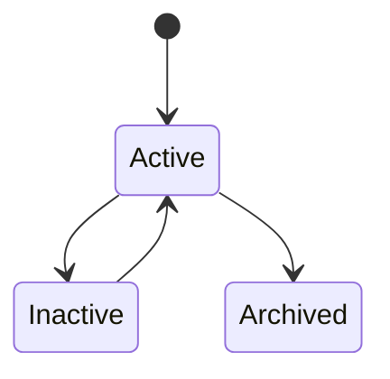
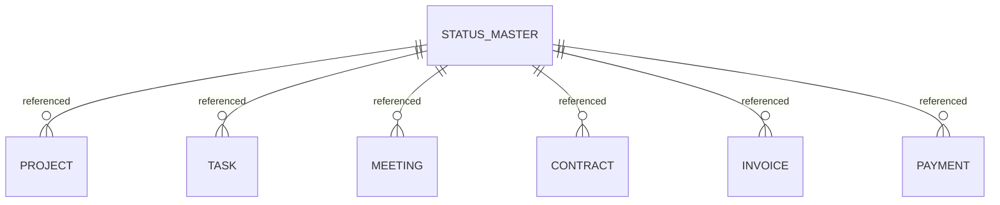

# StatusMaster

Version: 1.0

Status: Draft

Priority: ★★★★★ (Master Data)

---

# 1. 概要

StatusMasterは、VTaBridge OS全体で利用するステータス情報を統一管理するマスタである。

案件、商談、契約、請求、タスク、RPA、AIジョブなど、各機能で利用するステータスを一元管理し、画面表示・API・AI・ワークフローの共通基盤として利用する。

---

# 2. 責務

StatusMasterは以下を管理する。

- ステータスコード
- ステータス名称
- 対象エンティティ
- 表示順
- 表示色
- アイコン
- AI利用設定

---

# 3. ライフサイクル

---

# 4. テーブル定義

| Column | Type | Required | Description |
|---------|------|----------|-------------|
| id | UUID | ○ | 主キー |
| status_code | VARCHAR(50) | ○ | ステータスコード |
| status_name | VARCHAR(100) | ○ | ステータス名称 |
| target_entity | VARCHAR(100) | ○ | 対象エンティティ |
| display_color | VARCHAR(20) | × | 表示色（HEX） |
| icon | VARCHAR(100) | × | アイコン名 |
| description | TEXT | × | 説明 |
| sort_order | INT | ○ | 表示順 |
| is_initial | BOOLEAN | ○ | 初期ステータス |
| is_completed | BOOLEAN | ○ | 完了ステータス |
| enabled | BOOLEAN | ○ | 利用可否 |
| created_at | TIMESTAMP | ○ | 作成日時 |
| updated_at | TIMESTAMP | ○ | 更新日時 |
| deleted_at | TIMESTAMP | × | 論理削除 |

---

# 5. リレーション

---

# 6. Enum

## MasterStatus

- Active
- Inactive
- Archived

---

# 7. 業務ルール

- status_codeは一意とする
- target_entityごとに管理する
- 初期ステータスは1つのみ設定可能
- 削除は論理削除のみ
- 非表示はenabled=falseで管理する

---

# 8. AI機能

AIは以下を支援する。

- ステータス自動更新提案
- ボトルネック分析
- 停滞案件検知
- KPI分析
- ワークフロー最適化
- ステータス遷移分析

---

# 9. API

| Method | Endpoint |
|---------|----------|
| GET | /master/statuses |
| GET | /master/statuses/{id} |
| POST | /master/statuses |
| PUT | /master/statuses/{id} |
| DELETE | /master/statuses/{id} |

---

# 10. Index

- status_code
- target_entity
- enabled
- sort_order

---

# 11. KPI

StatusMasterから以下を集計する。

- ステータス登録数
- エンティティ別利用数
- ステータス遷移数
- 停滞ステータス件数
- AI自動更新率

---

# 12. Prisma実装方針

Model名

StatusMaster

Table名

status_master

UUIDを採用する。

status_codeにはUnique制約を設定する。

target_entityとの複合インデックスを設定する。

---

# 13. 将来拡張

将来的に以下を追加する。

- BPMNワークフロー連携
- AIステータス予測
- 自動ステータス更新
- SLA管理
- 業務フロー分析
- ステータス変更履歴管理
