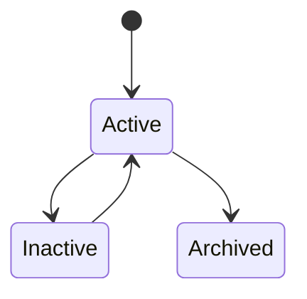
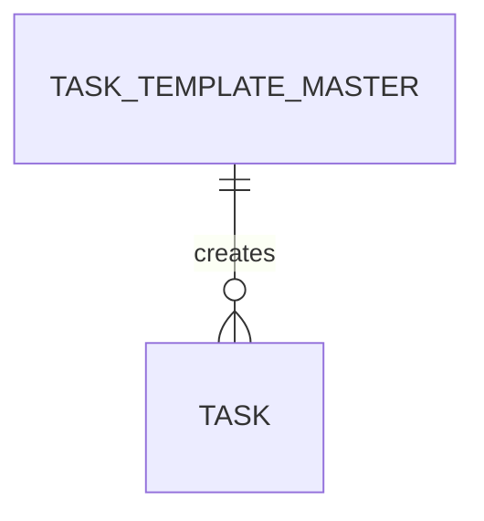

# TaskTemplateMaster

Version: 1.0

Status: Draft

Priority: ★★★★★ (Master Data)

---

# 1. 概要

TaskTemplateMasterは、VTaBridge OSで利用するタスクテンプレートを管理するマスタである。

営業活動、案件進行、契約、請求、フォローアップなどで利用する標準タスクを管理し、AI・RPA・ワークフローから自動生成するための基盤データとして利用する。

---

# 2. 責務

TaskTemplateMasterは以下を管理する。

- タスクテンプレート
- タスク種別
- 優先度
- 標準期限
- AI利用設定
- RPA利用設定

---

# 3. ライフサイクル

---

# 4. テーブル定義

| Column | Type | Required | Description |
|---------|------|----------|-------------|
| id | UUID | ○ | 主キー |
| template_code | VARCHAR(50) | ○ | テンプレートコード |
| template_name | VARCHAR(200) | ○ | テンプレート名 |
| task_type | VARCHAR(100) | ○ | タスク種別 |
| title_template | VARCHAR(255) | ○ | タイトルテンプレート |
| description_template | TEXT | × | 説明テンプレート |
| default_priority | VARCHAR(50) | ○ | 標準優先度 |
| default_due_days | INT | ○ | 期限（日数） |
| ai_generate | BOOLEAN | ○ | AI生成対象 |
| rpa_execute | BOOLEAN | ○ | RPA実行対象 |
| enabled | BOOLEAN | ○ | 有効フラグ |
| sort_order | INT | ○ | 表示順 |
| created_at | TIMESTAMP | ○ | 作成日時 |
| updated_at | TIMESTAMP | ○ | 更新日時 |
| deleted_at | TIMESTAMP | × | 論理削除 |

---

# 5. リレーション

---

# 6. Enum

## MasterStatus

- Active
- Inactive
- Archived

---

# 7. 業務ルール

- template_codeは一意とする
- テンプレート名は重複不可
- 無効テンプレートは自動生成対象外
- 削除は論理削除のみ

---

# 8. AI機能

AIは以下を支援する。

- タスク自動生成
- 優先順位判定
- 期限提案
- テンプレート推薦
- タスク最適化
- ワークフロー改善提案

---

# 9. API

| Method | Endpoint |
|---------|----------|
| GET | /master/task-templates |
| GET | /master/task-templates/{id} |
| POST | /master/task-templates |
| PUT | /master/task-templates/{id} |
| DELETE | /master/task-templates/{id} |

---

# 10. Index

- template_code
- template_name
- task_type
- enabled

---

# 11. KPI

TaskTemplateMasterから以下を集計する。

- テンプレート登録数
- 利用回数
- AI生成回数
- RPA実行回数
- テンプレート利用率

---

# 12. Prisma実装方針

Model名

TaskTemplateMaster

Table名

task_template_master

UUIDを採用する。

template_codeにはUnique制約を設定する。

template_nameにもUnique制約を設定する。

---

# 13. 将来拡張

将来的に以下を追加する。

- AIによるテンプレート自動生成
- 部門別テンプレート
- 顧客別テンプレート
- 業種別テンプレート
- ワークフロー自動生成
- AIによるタスク改善提案
