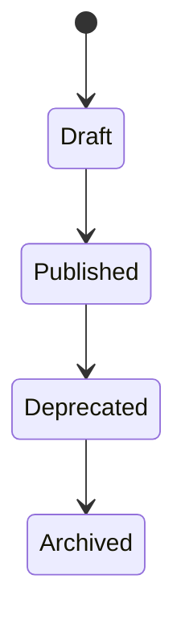
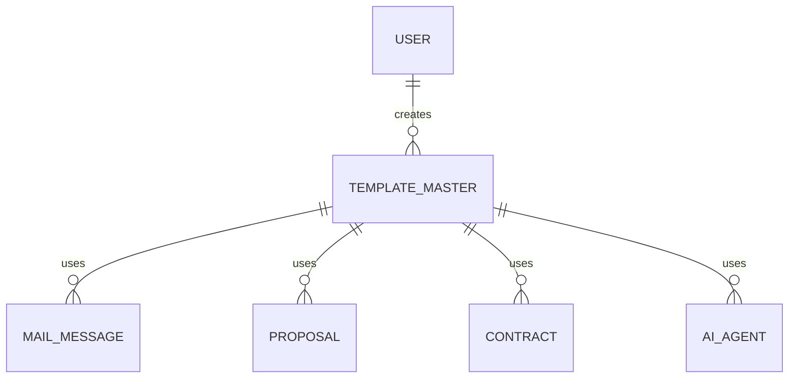

# TemplateMaster

Version: 1.0

Status: Draft

Priority: ★★★★★ (Master Data)

---

# 1. 概要

TemplateMasterは、VTaBridge OS全体で利用するテンプレートを管理するマスタである。

メール、提案書、契約書、議事録、AIプロンプト、RPA処理など、システム内で再利用可能なテンプレートを一元管理する。

AIエージェントやRPAが共通で利用する重要なマスタデータである。

---

# 2. 責務

TemplateMasterは以下を管理する。

- テンプレート情報
- テンプレート種別
- バージョン管理
- AIプロンプト
- 利用対象
- 公開状態

---

# 3. ライフサイクル

---

# 4. テーブル定義

| Column | Type | Required | Description |
|---------|------|----------|-------------|
| id | UUID | ○ | 主キー |
| template_code | VARCHAR(50) | ○ | テンプレートコード |
| template_name | VARCHAR(200) | ○ | テンプレート名 |
| template_type | TemplateType | ○ | テンプレート種別 |
| category | VARCHAR(100) | ○ | カテゴリ |
| version | VARCHAR(20) | ○ | バージョン |
| subject | VARCHAR(255) | × | 件名テンプレート |
| content | LONGTEXT | ○ | テンプレート本文 |
| ai_prompt | LONGTEXT | × | AIプロンプト |
| variables | JSON | × | 利用可能変数 |
| description | TEXT | × | 説明 |
| is_default | BOOLEAN | ○ | デフォルト |
| enabled | BOOLEAN | ○ | 利用可否 |
| created_by | UUID | ○ | 作成者 |
| created_at | TIMESTAMP | ○ | 作成日時 |
| updated_at | TIMESTAMP | ○ | 更新日時 |
| deleted_at | TIMESTAMP | × | 論理削除 |

---

# 5. リレーション

---

# 6. Enum

## TemplateType

- Email
- Proposal
- Contract
- Invoice
- MeetingMinutes
- AI
- Prompt
- RPA
- Notification
- Other

---

# 7. 業務ルール

- template_codeは一意とする
- デフォルトテンプレートは種別ごとに1件のみ
- バージョン管理を行う
- 削除は論理削除のみ
- 公開中テンプレートは編集不可（新バージョン作成）

---

# 8. AI機能

AIは以下を支援する。

- メール生成
- 提案書生成
- 契約書生成
- AIプロンプト生成
- テンプレート最適化
- 利用率分析
- テンプレート推薦
- 自動改善提案

---

# 9. API

| Method | Endpoint |
|---------|----------|
| GET | /master/templates |
| GET | /master/templates/{id} |
| POST | /master/templates |
| PUT | /master/templates/{id} |
| DELETE | /master/templates/{id} |

---

# 10. Index

- template_code
- template_name
- template_type
- category
- enabled

---

# 11. KPI

TemplateMasterから以下を集計する。

- テンプレート総数
- テンプレート利用回数
- AI生成回数
- テンプレート別利用率
- バージョン数
- AI改善提案数

---

# 12. Prisma実装方針

Model名

TemplateMaster

Table名

template_master

UUIDを採用する。

template_codeにはUnique制約を設定する。

(template_type, version)には複合Unique制約を設定する。

variablesはJSON型で管理する。

---

# 13. 将来拡張

将来的に以下を追加する。

- Markdownテンプレート対応
- Wordテンプレート対応
- Excelテンプレート対応
- PDFテンプレート対応
- AIテンプレートマーケット
- 部門別テンプレート
- 顧客別テンプレート
- AIによるテンプレート自動生成
