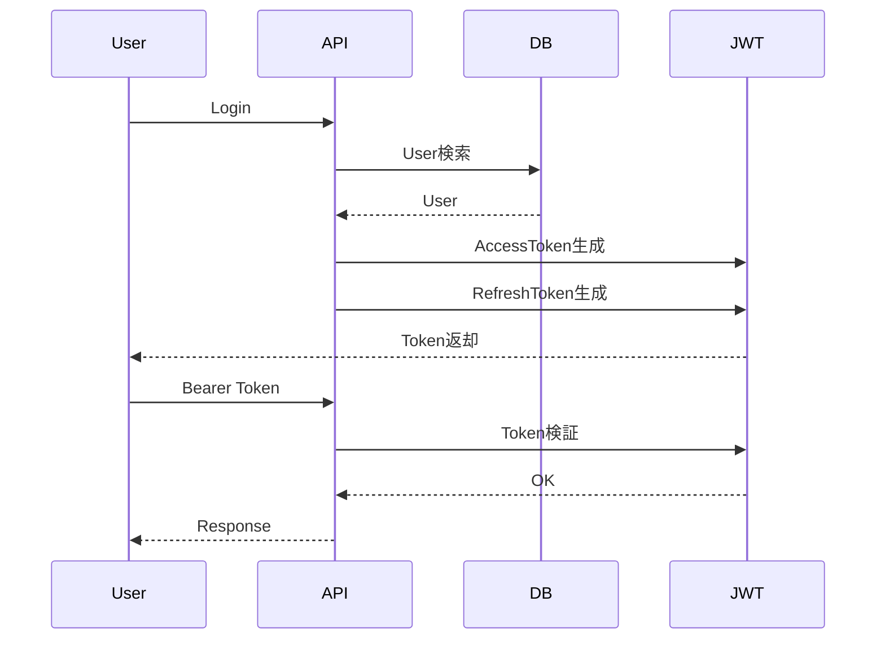

# Auth API

Version: 1.0

Status: Draft

Priority: ★★★★★ (Core API)

---

# 1. 概要

Auth APIは、VTaBridge OSの認証・認可を提供するAPIである。

JWT認証、Refresh Token、RBAC（Role Based Access Control）、MFA（多要素認証）を採用し、システム全体のセキュリティを担保する。

---

# 2. 認証フロー



---

# 3. API一覧

| Method | Endpoint | 説明 |
|---------|----------|------|
| POST | /api/v1/auth/login | ログイン |
| POST | /api/v1/auth/logout | ログアウト |
| POST | /api/v1/auth/refresh | Token更新 |
| GET | /api/v1/auth/me | ログインユーザー取得 |
| POST | /api/v1/auth/change-password | パスワード変更 |
| POST | /api/v1/auth/reset-password | パスワードリセット |
| POST | /api/v1/auth/verify-mfa | MFA認証 |
| POST | /api/v1/auth/register | ユーザー登録（管理者のみ） |

---

# 4. Login

## Request

```json
{
  "email":"admin@vtabridge.com",
  "password":"********"
}
```

---

## Response

```json
{
  "success":true,
  "data":{
    "accessToken":"xxxxx",
    "refreshToken":"xxxxx",
    "expiresIn":3600,
    "user":{
      "id":"UUID",
      "name":"Taro Yamada",
      "role":"Admin"
    }
  }
}
```

---

# 5. Refresh Token

Request

```json
{
    "refreshToken":"xxxxxxxx"
}
```

Response

```json
{
    "accessToken":"xxxx",
    "refreshToken":"xxxx"
}
```

---

# 6. Logout

Refresh Tokenを失効させる。

JWT Blacklistへ登録する。

---

# 7. User情報取得

GET

```
/api/v1/auth/me
```

Response

```json
{
    "id":"UUID",
    "name":"Taro",
    "email":"admin@test.com",
    "role":"Admin"
}
```

---

# 8. JWT

Algorithm

```
RS256
```

Claims

```
sub

name

email

role

iat

exp
```

Access Token

```
60分
```

Refresh Token

```
30日
```

---

# 9. MFA

対応予定

- TOTP

- Google Authenticator

- Microsoft Authenticator

- Email OTP

---

# 10. Password Policy

最低

- 10文字以上

必須

- 大文字

- 小文字

- 数字

- 記号

禁止

- 過去5回と同じ

有効期限

90日

---

# 11. Role

```
SuperAdmin

Admin

SalesManager

Sales

Recruiter

Engineer

Customer

Guest
```

---

# 12. Permission

| 権限 | 内容 |
|-------|------|
| user.read | ユーザー参照 |
| user.write | ユーザー編集 |
| customer.read | 顧客参照 |
| customer.write | 顧客編集 |
| engineer.read | エンジニア参照 |
| engineer.write | エンジニア編集 |
| project.read | 案件参照 |
| project.write | 案件編集 |
| ai.use | AI利用 |
| admin.all | 全権限 |

---

# 13. Error Code

| Code | 内容 |
|------|------|
| AUTH001 | Login Failed |
| AUTH002 | Invalid Password |
| AUTH003 | Invalid Token |
| AUTH004 | Token Expired |
| AUTH005 | Permission Denied |
| AUTH006 | MFA Required |
| AUTH007 | User Locked |
| AUTH008 | Password Expired |

---

# 14. Rate Limit

Login

```
5 req/min
```

Refresh

```
20 req/min
```

その他

```
100 req/min
```

---

# 15. Audit Log

保存項目

- UserID
- Email
- IP
- Device
- Browser
- LoginTime
- LogoutTime
- Result

---

# 16. OpenAPI

```yaml
paths:

  /auth/login:

    post:

      summary: Login

  /auth/logout:

    post:

      summary: Logout

  /auth/refresh:

    post:

      summary: Refresh Token
```

---

# 17. Prisma実装方針

Model

```
User
```

```
RefreshToken
```

```
Role
```

```
Permission
```

```
AuditLog
```

---

# 18. 将来拡張

- SSO（Microsoft Entra ID）
- Google Login
- GitHub Login
- LINE Login
- 生体認証
- Passkey
- OAuth2
- OpenID Connect
- SCIM
- Azure AD同期
